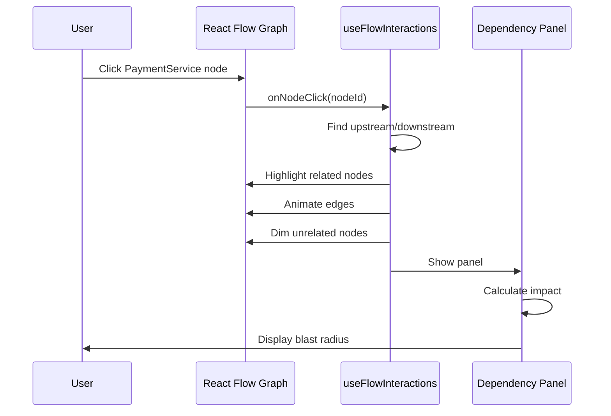
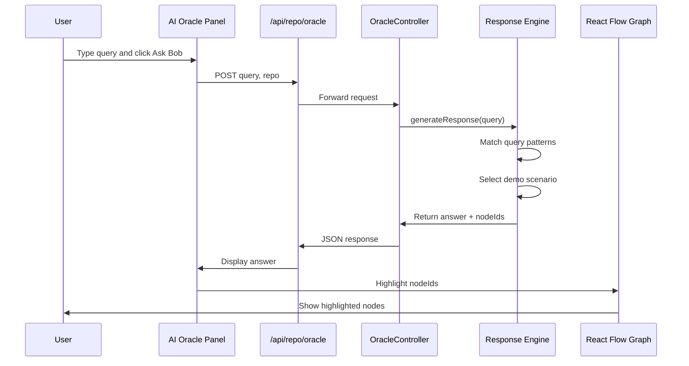
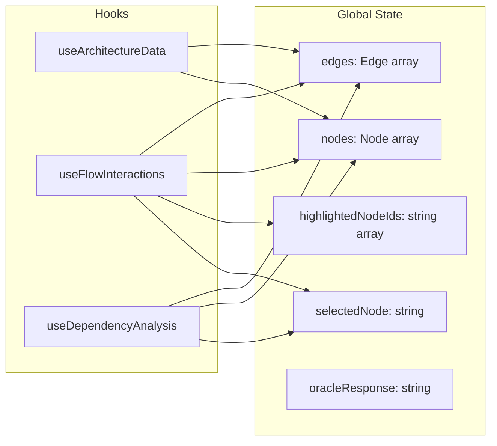
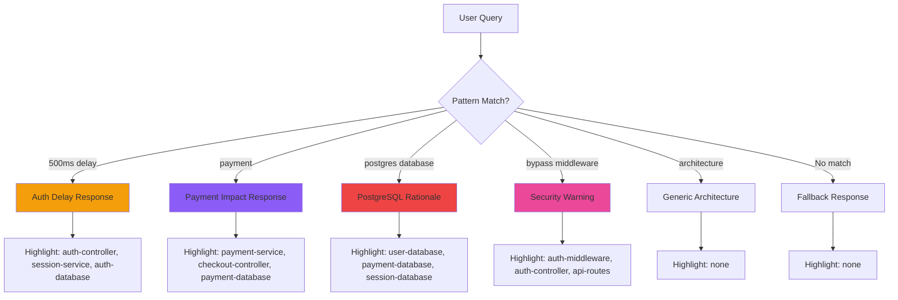
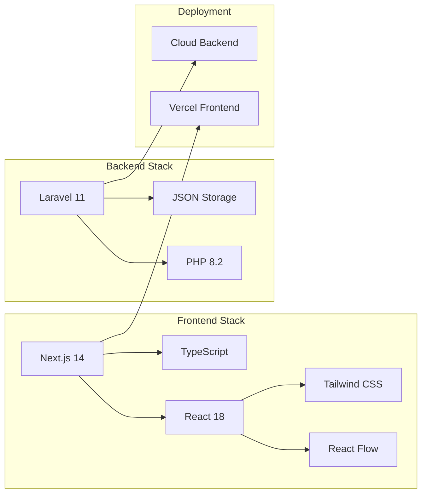

# AGA System Architecture

## High-Level Architecture

```mermaid
graph TB
    subgraph "Frontend - Next.js"
        UI[User Interface]
        Graph[React Flow Graph]
        Oracle[AI Oracle Panel]
        Deps[Dependency Panel]
    end
    
    subgraph "API Layer - Next.js API Routes"
        GraphAPI[/api/repo/graph]
        OracleAPI[/api/repo/oracle]
        ScanAPI[/api/repo/scan]
    end
    
    subgraph "Backend - Laravel"
        RepoCtrl[RepositoryController]
        OracleCtrl[OracleController]
        DemoData[demo-architecture.json]
        ResponseEngine[Deterministic Response Engine]
    end
    
    UI --> Graph
    UI --> Oracle
    UI --> Deps
    
    Graph --> GraphAPI
    Oracle --> OracleAPI
    
    GraphAPI --> RepoCtrl
    OracleAPI --> OracleCtrl
    
    RepoCtrl --> DemoData
    OracleCtrl --> ResponseEngine
    
    style UI fill:#3b82f6
    style Graph fill:#3b82f6
    style Oracle fill:#10b981
    style Deps fill:#8b5cf6
    style DemoData fill:#ef4444
    style ResponseEngine fill:#f59e0b
```

## Data Flow - User Clicks Node



## Data Flow - User Asks Oracle



## Component Hierarchy

```mermaid
graph TD
    Page[repos/name/page.tsx]
    Page --> Header[Header]
    Page --> SearchPanel[SearchPanel]
    Page --> ArchViz[ArchitectureVisualization]
    Page --> DepPanel[DependencyPanel]
    
    SearchPanel --> OraclePanel[AIOraclePanel]
    SearchPanel --> ExplorerPanel[ExplorerPanel]
    
    ArchViz --> ReactFlow[React Flow]
    ArchViz --> Toolbar[FlowToolbar]
    ArchViz --> Legend[LayerLegend]
    
    ReactFlow --> CustomNode[CustomNode]
    
    style Page fill:#1e293b
    style ArchViz fill:#3b82f6
    style SearchPanel fill:#10b981
    style DepPanel fill:#8b5cf6
```



## State Management



## Demo Architecture Graph Structure

```mermaid
graph TB
    subgraph "Frontend Layer"
        UD[UserDashboard]
        CP[CheckoutPage]
        PS[ProfileSettings]
    end
    
    subgraph "API Layer"
        AuthAPI[/api/auth]
        PayAPI[/api/payment]
        UserAPI[/api/user]
        AdminAPI[/api/admin]
    end
    
    subgraph "Middleware Layer"
        AuthMW[AuthMiddleware]
        RateMW[RateLimitMiddleware]
    end
    
    subgraph "Controller Layer"
        AuthCtrl[AuthController]
        PayCtrl[PaymentController]
        UserCtrl[UserController]
        AdminCtrl[AdminController]
    end
    
    subgraph "Service Layer"
        UserSvc[UserService]
        PaySvc[PaymentService]
        NotifSvc[NotificationService]
    end
    
    subgraph "Database Layer"
        UserDB[(Users Table)]
        PayDB[(Payments Table)]
        SessDB[(Sessions Table)]
    end
    
    UD --> AuthAPI
    UD --> UserAPI
    CP --> PayAPI
    PS --> UserAPI
    
    AuthAPI --> AuthMW
    PayAPI --> AuthMW
    UserAPI --> AuthMW
    AdminAPI --> AuthMW
    
    AuthMW --> AuthCtrl
    AuthMW --> UserCtrl
    PayAPI --> PayCtrl
    AdminAPI --> AdminCtrl
    
    AuthCtrl --> UserSvc
    AuthCtrl --> SessDB
    PayCtrl --> PaySvc
    UserCtrl --> UserSvc
    
    PaySvc --> PayDB
    PaySvc --> NotifSvc
    UserSvc --> UserDB
    
    style UD fill:#3b82f6
    style CP fill:#3b82f6
    style PS fill:#3b82f6
    style AuthAPI fill:#10b981
    style PayAPI fill:#10b981
    style UserAPI fill:#10b981
    style AdminAPI fill:#10b981
    style AuthMW fill:#ec4899
    style RateMW fill:#ec4899
    style AuthCtrl fill:#f59e0b
    style PayCtrl fill:#f59e0b
    style UserCtrl fill:#f59e0b
    style AdminCtrl fill:#f59e0b
    style UserSvc fill:#8b5cf6
    style PaySvc fill:#8b5cf6
    style NotifSvc fill:#8b5cf6
    style UserDB fill:#ef4444
    style PayDB fill:#ef4444
    style SessDB fill:#ef4444
```

## Oracle Response Patterns



## Technology Stack



## File Structure

```
AGA/
├── client/                          # Next.js Frontend
│   ├── app/
│   │   ├── api/
│   │   │   └── repo/
│   │   │       ├── graph/route.ts   # Graph API proxy
│   │   │       └── oracle/route.ts  # Oracle API proxy
│   │   └── app/(dashboard)/
│   │       └── repos/[name]/
│   │           └── page.tsx         # Main graph page
│   ├── components/
│   │   ├── architecture-visualization.tsx
│   │   ├── search-panel.tsx
│   │   ├── dependency-panel.tsx
│   │   └── architecture/
│   │       ├── ai-oracle-panel.tsx
│   │       ├── layer-legend.tsx
│   │       └── flow-toolbar.tsx
│   ├── hooks/
│   │   ├── use-architecture-data.ts
│   │   ├── use-flow-interactions.ts
│   │   └── use-dependency-analysis.ts
│   ├── lib/
│   │   └── oracle.ts                # Oracle API client
│   └── types/
│       └── graph.ts                 # TypeScript types
│
└── api/                             # Laravel Backend
    ├── app/
    │   └── Http/Controllers/Api/
    │       ├── RepositoryController.php
    │       └── OracleController.php # NEW
    ├── routes/
    │   └── api.php
    └── storage/app/
        └── demo-architecture.json   # NEW - Demo dataset
```

## Key Integration Points

1. **Graph Loading**: `useArchitectureData` → `/api/repo/graph` → `RepositoryController@graph` → `demo-architecture.json`

2. **Node Selection**: User click → `useFlowInteractions` → Highlight logic → Update nodes/edges state

3. **Oracle Query**: User search → `AIOraclePanel` → `/api/repo/oracle` → `OracleController@query` → Pattern matching → Response + nodeIds

4. **Blast Radius**: Selected node → `useDependencyAnalysis` → Calculate upstream/downstream → Display in `DependencyPanel`

5. **Highlighting Sync**: Oracle response → `highlightedNodeIds` state → `useFlowInteractions` → Graph updates

## Performance Considerations

- **Graph Rendering**: React Flow handles 15-20 nodes efficiently
- **State Updates**: Use React.memo for CustomNode to prevent unnecessary re-renders
- **API Calls**: Cache graph data, Oracle responses are fast (< 500ms)
- **Animations**: Use CSS transitions (300-500ms) for smooth UX

## Security Notes

- No authentication required for demo
- Oracle responses are deterministic (no external API calls)
- Demo data is static JSON (no database queries)
- All data is read-only during demo

---

This architecture is optimized for a 48-hour hackathon demo, prioritizing:
- **Reliability**: No external dependencies that can fail
- **Performance**: Fast response times for impressive demo
- **Clarity**: Clear separation of concerns for team collaboration
- **Impact**: Visual and functional features that wow judges