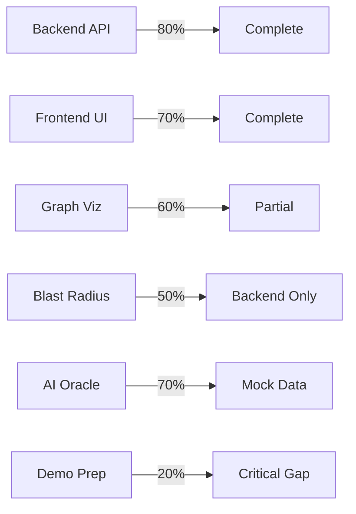

**User:**

<task>
here is out project fsd 'AGA-FSD.pdf' (see below for file content) can scan this current project and check if we are lready on the right trrack, what are need still and what is done, give me general progress precentage
</task>

<file_content path="AGA-FSD.pdf">
  1 | 
  2 | 
  3 | CONTEXT 
  4 | 
  5 | Here is the complete Functional Specification Document (FSD) tailored specifically for 
  6 | your 48-hour sprint. This document will serve as your team's "North Star," keeping you 
  7 | focused on the features that actually win hackathons rather than getting lost in the 
  8 | weeds. 
  9 |  
 10 | 2. Target Audience & Business Value 
 11 | ● Junior Developers: Drastically reduces onboarding time by allowing them to 
 12 | visually explore and query the codebase's intent instead of reading 
 13 | documentation. 
 14 | ● Senior Architects: Provides a visual governance tool to track architectural drift 
 15 | (e.g., frontend components bypassing the API layer). 
 16 | ● Management / C-Suite: Mitigates the financial risk of system outages caused by 
 17 | blind refactoring and preserves the Intellectual Property (IP) of departing senior 
 18 | engineers. 
 19 | 3. Core Features (The MVP Scope) 
 20 | Feature 1: The Living Blueprint (Graph Visualization) 
 21 | ● Description: A dynamic UI where the codebase is rendered as a node-based 
 22 | network graph. 
 23 | ● Requirements: 
 24 | ○ Nodes represent distinct entities: Controllers, Services, API Routes, and 
 25 | Database Tables. 
 26 | ○ Edges (lines) represent dependencies (e.g., UserController connects to 
 27 | UserService and AuthMiddleware). 
 28 | ○ Color-coding for different layers (e.g., Blue for Frontend, Green for APIs, 
 29 | Orange for Database). 
 30 | Feature 2: The "Blast Radius" Analyzer (Impact Tracking) 
 31 | ● Description: An interactive dependency tracker. 
 32 | ● Requirements: 
 33 | ○ When a user clicks a node (e.g., PaymentService), the graph dims 
 34 | unrelated nodes andFunctional Specification 
 35 | Document (FSD) 
 36 | ○ Project Name: AGA (Architecture Governance 
 37 | Agent) 
 38 | ○ Tagline: Google Maps for Software Architecture. 
 39 | 
 40 | ○ 
 41 | 1. Project Overview 
 42 | ○ AGA is an interactive, AI-powered knowledge graph that visualizes a 
 43 | software repository's architecture, dependencies, and historical intent. 
 44 | Powered by IBM Bob, it transforms raw codebase files into a searchable, 
 45 | living ecosystem. It solves the enterprise crises of "Brain Drain," technical 
 46 | debt accumulation, and dangerous code regressions by providing 
 47 | developers with total architectural visibility before they write a single line of 
 48 | code. 
 49 | ○  highlights all upstream/downstream dependencies. 
 50 | ○ A side panel displays a summary: "Changing this file impacts 3 API routes 
 51 | and 2 Database models." 
 52 | Feature 3: The Contextual Oracle (Natural Language AI Search) 
 53 | ● Description: A search interface powered by IBM Bob’s full-repository context. 
 54 | ● Requirements: 
 55 | ○ A search bar where users can ask: "What happens if I bypass the 
 56 | AuthMiddleware here?" or "Why do we use PostgreSQL for this specific 
 57 | module?" 
 58 | ○ Action: IBM Bob processes the query, returns a text explanation (The 
 59 | "Why"), and simultaneously highlights the relevant nodes on the visual 
 60 | graph to show the "Where." 
 61 | 4. Technical Architecture 
 62 | Frontend (The Visual Command Center) 
 63 | ● Framework: React.js 
 64 | ● Graph Library: React Flow or Cytoscape.js (Highly recommended for rapid, 
 65 | beautiful node-graph rendering in hackathons). 
 66 | ● Styling: Tailwind CSS (Sleek, dark-mode dashboard UI to make the colorful 
 67 | graph pop). 
 68 | Backend (The Data Orchestrator) 
 69 | ● Framework: Node.js (Express) or Laravel (Use whichever your team can spin up 
 70 | faster). 
 71 | ● Core Task: Parse the target repository's structure (folders/files) and convert it 
 72 | into a flat JSON format (Nodes and Edges) that the frontend graph library can 
 73 | read. 
 74 | AI Integration (IBM Bob) 
 75 | ● Role: The "Brain" of the operation. 
 76 | 
 77 | ● Task 1 (Setup): Bob analyzes the target repository to generate the initial map of 
 78 | dependencies. 
 79 | ● Task 2 (Active): Bob receives the natural language queries from the frontend, 
 80 | cross-references them with the repository context, and returns the explanations. 
 81 | 5. User Journey / Hackathon Demo Script 
 82 | This is exactly how you will walk the judges through the app in your final presentation: 
 83 | 1. The Hook: Start on the main dashboard showing the massive, complex web of 
 84 | the dummy repository. "This is what a legacy system looks like to a new hire: 
 85 | Chaos." 
 86 | 2. The Blast Radius: Click on a core database node. "Before making a change, 
 87 | AGA shows you exactly what will break." The graph instantly highlights the 
 88 | impacted services. 
 89 | 3. The Oracle: Type in the search bar: "Why is there a 500ms delay in the User 
 90 | Auth controller?" 
 91 | 4. The Reveal: The graph highlights the Auth Controller node, and the side panel 
 92 | populates with IBM Bob's answer: "In 2024, this was added to prevent a race 
 93 | condition during database writes. Do not remove it without refactoring the 
 94 | queuing system." 
 95 | 5. The Closer: "We didn't just map the code; we mapped the intent." 
 96 | 6. 48-Hour Execution Plan (Division of Labor) 
 97 | ● Frontend Lead (You/UI Designer): Scaffold the React app. Implement React 
 98 | Flow
 99 |  to render dummy JSON data. Make the UI look like a premium enterprise 
100 | tool (dark mode, smooth animations). 
101 | ● Backend Lead: Build the API that serves the JSON graph data. Write the script 
102 | that takes a prompt from the frontend, sends it to IBM Bob, and returns the 
103 | response. 
104 | ● The "Hacker" (Integration): Prepare the "Dummy Repository" with intentional 
105 | bad code and fake historical commits so that Bob has an interesting story to tell 
106 | during the demo. 
107 |  
108 | Next Steps for your Team: 
109 | 1. Decide immediately if you are using React Flow or another library for the graph. 
110 | 2. Set up the "Dummy Repo" that AGA will map out. 
111 | Does this document give your team enough clarity to hit the ground running as soon as 
112 | the clock starts? 
113 | 
114 |  
115 | 
116 | TASKS 
117 | 
118 | This is the critical next step. A 48-hour sprint lives or dies by how well the team divides the 
119 | labor. Since this project requires a mix of complex AI orchestration, visual graph rendering, and 
120 | a compelling story for the judges, a 4-person team is the perfect size. 
121 | Here is the strategic task assignment to ensure nobody is blocked and everything comes 
122 | together flawlessly for the submission. 
123 |  
124 | Team Assignment: Project AGA 
125 | Player 1: Core Backend & AI Architect (Charles) 
126 | Your focus is purely on the logic, the data flow, and taming the AI. You handle the "invisible" 
127 | magic. 
128 | ● Deliverable 1 (The Pipeline): Set up the backend server (Node.js or Laravel) to act as 
129 | the middleman between the frontend and IBM Bob. 
130 | ● Deliverable 2 (The Parser): Write the script that scans the target repository's folders 
131 | and files and translates them into a flat JSON format (nodes and edges) for the frontend 
132 | to render. 
133 | ● Deliverable 3 (Bob Orchestration): Write the system prompts and handle the API calls 
134 | to IBM Bob. When the frontend asks a question, your backend must feed Bob the 
135 | question plus the repository context, and return the answer. 
136 | ● Deliverable 4 (CI/CD): Set up the GitHub Action that triggers the initial codebase scan. 
137 | Player 2: Frontend & Visualization Lead (Mark) 
138 | This person needs strong React skills and must be comfortable reading documentation for 
139 | graph libraries under pressure. 
140 | ● Deliverable 1 (The Graph): Integrate React Flow (or Cytoscape.js) to consume the 
141 | JSON data generated by Player 1 and render the interactive node network. 
142 | ● Deliverable 2 (The Blast Radius): Write the frontend logic so that clicking a node 
143 | visually highlights its connected edges and dims the rest of the graph. 
144 | ● Deliverable 3 (The UI Shell): Build the dark-mode dashboard (using Tailwind CSS) with 
145 | the search bar, the side panel for AI responses, and the main canvas area. 
146 | ● Deliverable 4 (API Wiring): Connect the frontend search bar to Player 1's backend 
147 | endpoint. 
148 | Player 3: The "Context Hacker" (Dummy Repo & Data Lead) (Regie) 
149 | This is the most underrated role. AGA looks useless if it scans an empty repository. This person 
150 | builds the "crime scene" for your demo. 
151 | ● Deliverable 1 (The Dummy App): Scaffold a fake, chaotic repository (e.g., a messy 
152 | Laravel/React e-commerce app) with distinct controllers, services, and database 
153 | schemas. 
154 | ● Deliverable 2 (The Rubbish Code): Intentionally write bad architectural code (e.g., a 
155 | frontend file doing a direct DB query, or a controller with a hardcoded 500ms delay). 
156 | 
157 | ● Deliverable 3 (The Fake History): Backdate several Git commits and write fake Pull 
158 | Request discussions (e.g., "Adding this delay to prevent a race condition") so IBM Bob 
159 | has historical context to discover. 
160 | ● Deliverable 4 (Testing): Act as QA. Continuously run the backend parser against this 
161 | dummy repo to ensure Player 1 and Player 2 have rich, realistic data to work with. 
162 | Player 4: Product Manager & Pitch Engineer (Justine) 
163 | While the others code, this person secures the points. Lablab.ai hackathons are won on 
164 | presentation and fulfilling the strict submission criteria. 
165 | ● Deliverable 1 (The IBM Bob Report): Crucial. Manage the export of the IBM Bob 
166 | task/session report required by the rules and ensure it is committed to your public 
167 | GitHub repo. 
168 | ● Deliverable 2 (The Script): Write the 3-minute video pitch script focusing heavily on 
169 | "Business Value" and "Architectural Governance," using the dummy repo's "bad code" 
170 | as the villain. 
171 | ● Deliverable 3 (Video Production): Record the screen-capture of the final demo, narrate 
172 | the pitch, edit the video (e.g., using CapCut), and create the required Cover Image and 
173 | Slide Presentation. 
174 | ● Deliverable 4 (Project Submission): Handle the Lablab.ai platform submission page, 
175 | write the Long/Short descriptions, and ensure all links (GitHub, Demo URL, Video) are 
176 | public and working before the deadline. 
177 |  
178 | The 48-Hour Battle Rhythm 
179 | ● Hours 0–12 (Heads Down): * Player 1 figures out the JSON structure needed for the 
180 | graph. 
181 | ○ Player 2 gets a static graph rendering with hardcoded dummy data. 
182 | ○ Player 3 builds the messy repository. 
183 | ○ Player 4 drafts the pitch narrative based on the FSD. 
184 | ● Hours 12–36 (The Wiring): * Player 1 and 2 connect the real backend to the frontend. 
185 | ○ Player 1 wires up IBM Bob to read Player 3's dummy repo. 
186 | ○ Player 3 stress-tests the AI queries. 
187 | ● Hours 36–48 (The Polish & Pitch): * Feature freeze. Stop coding new things. 
188 | ○ Player 4 records the demo using the live app. 
189 | ○ Everyone helps Player 4 polish the presentation and double-check submission 
190 | requirements. 
191 | How does this distribution look? If one of your teammates has a vastly different skillset, we can 
192 | adjust the deliverables to match their strengths. 
193 |  
194 | 
195 | STACK 
196 | 
197 | In a 48-hour sprint, you do not learn new frameworks. You use the tools you can build with 
198 | blindfolded, so you can spend your cognitive energy on the AI logic and the presentation. 
199 | Given the architecture of the AGA (Axiom) project and the need for a robust backend to handle 
200 | repository parsing and AI orchestration, here is the exact, battle-tested tech stack your team 
201 | should deploy: 
202 | The 48-Hour Hackathon Stack 
203 | 1. Backend (The Orchestrator) 
204 | ● Framework: Laravel * Why: You need complex routing, queue management (for slow AI 
205 | API calls), and robust backend logic. Laravel allows you to spin up secure REST 
206 | endpoints in minutes. It acts as the perfect middleman to securely store your IBM Bob 
207 | API credentials and process the heavy lifting of parsing Git repositories. 
208 | ● Package/Tool: git (native CLI) 
209 | ○ Why: Your backend needs to clone the target repository and read commit 
210 | histories. Using native Git commands via PHP's 
211 | shell_exec is often faster than 
212 | wrestling with a third-party Git library. 
213 | 2. Frontend (The Visual Command Center) 
214 | ● Framework: React 
215 | ○ Why: Component-based architecture is mandatory for a complex UI like a 
216 | node-graph dashboard. 
217 | ● Graph Library: React Flow 
218 | ○ Why: This is the industry standard for building interactive node-based UIs in 
219 | React. It handles the physics, zooming, panning, and node-clicking out of the box 
220 | so you don't have to write canvas math from scratch. 
221 | ● Styling: Tailwind CSS 
222 | ○ Why: Rapid, utility-first styling. You need to make the dashboard look like a sleek, 
223 | dark-mode enterprise tool without writing custom CSS files. 
224 | 3. Database (The Speed Layer) 
225 | ● Database: PostgreSQL 
226 | ○ Why: You might wonder why you need a database if you are just analyzing a 
227 | GitHub repo. Caching. AI APIs (like IBM Bob) can take 5–10 seconds to 
228 | respond. For a flawless live demo, your Laravel backend should cache the 
229 | repository's "nodes and edges" and Bob's historical answers in PostgreSQL. 
230 | When the judges click around, the app will feel lightning fast. 
231 | 4. The AI & CI/CD Pipeline 
232 | ● The AI: IBM Bob (API or CLI) 
233 | ○ Why: Mandatory for the hackathon. Your Laravel backend will construct prompts 
234 | combining the code diffs and historical context, send them to Bob, and parse the 
235 | JSON responses. 
236 | ● The Trigger: GitHub Actions 
237 | 
238 | ○ Why: To prove the "governance" aspect, you need a workflow file 
239 | (
240 | .github/workflows/axiom.yml) that fires off a webhook to your Laravel server 
241 | whenever a new Pull Request is opened in your dummy repository. 
242 |  
243 | How the Data Flows (The Architecture) 
244 | 1. Trigger: A developer opens a Pull Request on GitHub. 
245 | 2. Action: GitHub Actions sends a payload to your Laravel backend. 
246 | 3. Ingestion: Laravel pulls the code diff and queries PostgreSQL for the historical context 
247 | of those specific files. 
248 | 4. AI Processing: Laravel formats this data and asks IBM Bob for an architectural review. 
249 | 5. Visualization: The React/React Flow frontend requests the updated system map from 
250 | Laravel, highlighting the "Blast Radius" of the PR on the dashboard. 
251 | This stack leans heavily on strong backend logic and API orchestration, which is exactly what is 
252 | needed to make a complex AI agent work reliably. 
253 | Does the team have a preference on how to handle the local development environment for this 
254 | stack (e.g., Docker, Laravel Sail, or bare metal)? 
255 |  

</file_content>
<environment_details>
# VSCode Visible Files


# VSCode Open Tabs


# Current Time
Current time in ISO 8601 UTC format: 2026-05-17T13:27:44.495Z
User time zone: Asia/Manila, UTC+8:00

# Current Cost
$0.00

# Review Exclusions
The following file patterns are excluded from code reviews:
- .vscode/**

# Current Mode
<slug>plan</slug>
<name>📝 Plan</name>


# Current Workspace Directory (/home/augustine/Documents/Git/aga) Files
.env.example
.gitignore
.releaserc
AGA-FSD.pdf
CHANGELOG.md
commitlint.config.js
dev.php.ini
docker-compose.yml
DOCKER.md
flake.lock
.husky/
api/
api/.dockerignore
api/.editorconfig
api/.env.example
api/.gitattributes
api/.gitignore
api/.npmrc
api/artisan
api/composer.json
api/composer.lock
api/Dockerfile
api/entrypoint.sh
api/IMPLEMENTATION_GUIDE.md
api/package.json
api/php.ini
api/phpunit.xml
api/QUICK_START.md
api/README.md
api/SCALAR_DOCUMENTATION.md
api/vite.config.js
api/app/Http/Controllers/AIController.php
api/app/Http/Controllers/AuthController.php
api/app/Http/Controllers/Controller.php
api/app/Http/Controllers/GitHubOAuthController.php
api/app/Http/Controllers/PasswordResetController.php
api/app/Http/Controllers/RepositoryController.php
api/app/Http/Controllers/Api/AiHistoryController.php
api/app/Http/Controllers/Api/RepositoryController.php
api/app/Http/Controllers/Api/ScanLogController.php
api/app/Http/Controllers/Api/SettingsController.php
api/app/Jobs/CloneAndAnalyzeRepository.php
api/app/Models/AICache.php
api/app/Models/AiHistory.php
api/app/Models/AppSetting.php
api/app/Models/Edge.php
api/app/Models/Node.php
api/app/Models/Repository.php
api/app/Models/ScanLog.php
api/app/Models/User.php
api/app/Providers/AppServiceProvider.php
api/app/Services/GitHubService.php
api/app/Services/IBMBobService.php
api/app/Services/RepositoryParserService.php
api/bootstrap/app.php
api/bootstrap/providers.php
api/bootstrap/cache/.gitignore
api/config/app.php
api/config/auth.php
api/config/cache.php
api/config/cors.php
api/config/database.php
api/config/filesystems.php
api/config/logging.php
api/config/mail.php
api/config/queue.php
api/config/sanctum.php
api/config/scalar.php
api/config/scribe.php
api/config/services.php
api/config/session.php
api/database/.gitignore
api/database/factories/UserFactory.php
api/database/migrations/0001_01_01_000000_create_users_table.php
api/database/migrations/0001_01_01_000001_create_cache_table.php
api/database/migrations/0001_01_01_000002_create_jobs_table.php
api/database/migrations/2026_05_17_034646_create_personal_access_tokens_table.php
api/database/migrations/2026_05_17_045145_add_github_oauth_fields_to_users_table.php
api/database/migrations/2026_05_17_110000_create_repositories_table.php
api/database/migrations/2026_05_17_110100_create_app_settings_table.php
api/database/migrations/2026_05_17_110200_create_scan_logs_table.php
api/database/migrations/2026_05_17_110300_create_ai_history_table.php
api/engine/scanner.ts
api/engine/scanner/layout-engine.ts
api/engine/scanner/types.ts
api/public/.htaccess
api/public/favicon.ico
api/public/index.php
api/public/robots.txt
api/resources/css/app.css
api/resources/js/app.js
api/resources/views/welcome.blade.php
api/resources/views/scribe/index.blade.php
api/routes/api.php
api/routes/console.php
api/routes/web.php
api/storage/app/.gitignore
api/storage/app/private/.gitignore
api/storage/app/public/.gitignore
api/storage/framework/.gitignore
api/storage/framework/cache/.gitignore
api/storage/framework/cache/data/.gitignore
api/storage/framework/sessions/.gitignore
api/storage/framework/testing/.gitignore
api/storage/framework/views/.gitignore
api/storage/logs/.gitignore
api/tests/Pest.php
api/tests/TestCase.php
api/tests/Feature/ExampleTest.php
api/tests/Unit/ExampleTest.php
client/
client/.env.example
client/.eslintrc.json
client/middleware.ts
client/next.config.mjs
client/postcss.config.mjs
client/app/page.tsx
client/app/api/repo/ai-history/route.ts
client/app/api/repo/graph/route.ts
client/app/api/repo/list/route.ts
client/app/api/repo/logs/route.ts
client/app/api/repo/status/route.ts
client/app/api/settings/route.ts
client/components/theme-provider.tsx
client/components/architecture/ai-oracle-panel.tsx
client/components/architecture/architecture-visualization.tsx
client/components/architecture/custom-node.tsx
client/components/architecture/dependency-panel.tsx
client/components/architecture/explorer-panel.tsx
client/components/architecture/flow-toolbar.tsx
client/components/architecture/review-impact-dialog.tsx
client/components/architecture/search-panel.tsx
client/components/auth/forgot-password-form.tsx
client/components/auth/login-form.tsx
client/components/auth/register-form.tsx
client/components/auth/reset-password-form.tsx
client/components/dashboard/connect-repo-dialog.tsx
client/components/dashboard/repository-card.tsx
client/components/dashboard/stats-card.tsx
client/components/dashboard/welcome-banner.tsx
client/components/layout/app-sidebar.tsx
client/components/layout/dynamic-breadcrumbs.tsx
client/components/layout/header-actions.tsx
client/components/layout/header.tsx
client/components/layout/logo.tsx
client/components/layout/nav-user.tsx
client/components/layout/page-header.tsx
client/components/ui/accordion.tsx
client/components/ui/alert-dialog.tsx
client/components/ui/alert.tsx
client/components/ui/aspect-ratio.tsx
client/components/ui/avatar.tsx
client/components/ui/badge.tsx
client/components/ui/breadcrumb.tsx
client/components/ui/button-group.tsx
client/components/ui/button.tsx
client/components/ui/calendar.tsx
client/components/ui/card.tsx
client/components/ui/checkbox.tsx
client/components/ui/collapsible.tsx
client/components/ui/command.tsx
client/components/ui/dialog.tsx
client/components/ui/empty.tsx
client/components/ui/field.tsx
client/components/ui/form.tsx
client/components/ui/hover-card.tsx
client/components/ui/input-group.tsx
client/components/ui/kbd.tsx
client/components/ui/label.tsx
client/components/ui/menubar.tsx
client/components/ui/navigation-menu.tsx
client/components/ui/pagination.tsx
client/components/ui/popover.tsx
client/components/ui/progress.tsx
client/components/ui/scroll-area.tsx
client/components/ui/select.tsx
client/components/ui/separator.tsx
client/components/ui/sheet.tsx
client/components/ui/sidebar.tsx
client/components/ui/skeleton.tsx
client/components/ui/slider.tsx
client/components/ui/sonner.tsx
client/components/ui/spinner.tsx
client/components/ui/table.tsx
client/components/ui/textarea.tsx
client/components/ui/toast.tsx
client/components/ui/toaster.tsx
client/components/ui/toggle-group.tsx
client/components/ui/toggle.tsx
docs/
docs/AGA_48HR_SPRINT_PLAN.md
docs/ARCHITECTURE_DIAGRAM.md
docs/AUTHENTICATION_GUIDE.md
docs/DESIGN.md
docs/ENVIRONMENT_SETUP.md
docs/ENVIRONMENT_VARIABLES_ANALYSIS.md
docs/GITHUB_OAUTH_FIX.md
docs/GITHUB_OAUTH_GUIDE.md
docs/TEAM_ASSIGNMENTS.md
scripts/

(File list truncated. Use list_files on specific subdirectories if you need to explore further.)
You have not created a todo list yet. Create one with `update_todo_list` if your task is complicated or involves multiple steps.
</environment_details>

---

**Assistant:**

I'll analyze your AGA project against the FSD to assess progress and identify what's done and what's still needed.

<read_file>
<args>
  <file>
    <path>api/app/Http/Controllers/RepositoryController.php</path>
  </file>
  <file>
    <path>api/app/Services/RepositoryParserService.php</path>
  </file>
  <file>
    <path>api/app/Services/IBMBobService.php</path>
  </file>
  <file>
    <path>client/components/architecture/architecture-visualization.tsx</path>
  </file>
  <file>
    <path>api/app/Jobs/CloneAndAnalyzeRepository.php</path>
  </file>
</args>
</read_file>

---

**User:**

[read_file for 5 files] Result:
<files>
<file><path>api/app/Http/Controllers/RepositoryController.php</path>
<content lines="1-313">
  1 | <?php
  2 | 
  3 | namespace App\Http\Controllers;
  4 | 
  5 | use App\Models\Repository;
  6 | use App\Services\GitHubService;
  7 | use App\Jobs\CloneAndAnalyzeRepository;
  8 | use Illuminate\Http\Request;
  9 | use Illuminate\Http\JsonResponse;
 10 | use Illuminate\Support\Facades\Validator;
 11 | 
 12 | class RepositoryController extends Controller
 13 | {
 14 |     protected GitHubService $githubService;
 15 | 
 16 |     public function __construct(GitHubService $githubService)
 17 |     {
 18 |         $this->githubService = $githubService;
 19 |     }
 20 | 
 21 |     /**
 22 |      * List all repositories
 23 |      */
 24 |     public function index(): JsonResponse
 25 |     {
 26 |         $repositories = Repository::orderBy('created_at', 'desc')
 27 |             ->get()
 28 |             ->map(function ($repo) {
 29 |                 return [
 30 |                     'id' => $repo->id,
 31 |                     'name' => $repo->name,
 32 |                     'full_name' => $repo->full_name,
 33 |                     'owner' => $repo->owner,
 34 |                     'description' => $repo->description,
 35 |                     'url' => $repo->url,
 36 |                     'language' => $repo->language,
 37 |                     'status' => $repo->status,
 38 |                     'last_scanned_at' => $repo->last_scanned_at?->toIso8601String(),
 39 |                     'metadata' => $repo->metadata,
 40 |                     'created_at' => $repo->created_at->toIso8601String(),
 41 |                 ];
 42 |             });
 43 | 
 44 |         return response()->json([
 45 |             'success' => true,
 46 |             'data' => $repositories,
 47 |         ]);
 48 |     }
 49 | 
 50 |     /**
 51 |      * Connect a new repository
 52 |      */
 53 |     public function connect(Request $request): JsonResponse
 54 |     {
 55 |         $validator = Validator::make($request->all(), [
 56 |             'url' => 'required|string',
 57 |         ]);
 58 | 
 59 |         if ($validator->fails()) {
 60 |             return response()->json([
 61 |                 'success' => false,
 62 |                 'message' => 'Validation failed',
 63 |                 'errors' => $validator->errors(),
 64 |             ], 422);
 65 |         }
 66 | 
 67 |         try {
 68 |             // Parse GitHub URL
 69 |             $parsed = GitHubService::parseGitHubUrl($request->url);
 70 |             
 71 |             if (!$parsed) {
 72 |                 return response()->json([
 73 |                     'success' => false,
 74 |                     'message' => 'Invalid GitHub URL format',
 75 |                 ], 400);
 76 |             }
 77 | 
 78 |             // Check if repository already exists
 79 |             $existing = Repository::where('full_name', "{$parsed['owner']}/{$parsed['repo']}")->first();
 80 |             
 81 |             if ($existing) {
 82 |                 return response()->json([
 83 |                     'success' => false,
 84 |                     'message' => 'Repository already connected',
 85 |                     'data' => [
 86 |                         'id' => $existing->id,
 87 |                         'status' => $existing->status,
 88 |                     ],
 89 |                 ], 409);
 90 |             }
 91 | 
 92 |             // Fetch repository information from GitHub
 93 |             $repoData = $this->githubService->getRepository($parsed['owner'], $parsed['repo']);
 94 | 
 95 |             // Create repository record
 96 |             $repository = Repository::create([
 97 |                 ...$repoData,
 98 |                 'local_path' => $this->githubService->getLocalPath($parsed['owner'], $parsed['repo']),
 99 |                 'status' => 'pending',
100 |             ]);
101 | 
102 |             // Dispatch job to clone and analyze repository
103 |             CloneAndAnalyzeRepository::dispatch($repository);
104 | 
105 |             return response()->json([
106 |                 'success' => true,
107 |                 'message' => 'Repository connection initiated',
108 |                 'data' => [
109 |                     'id' => $repository->id,
110 |                     'name' => $repository->name,
111 |                     'full_name' => $repository->full_name,
112 |                     'status' => $repository->status,
113 |                 ],
114 |             ], 201);
115 |         } catch (\Exception $e) {
116 |             return response()->json([
117 |                 'success' => false,
118 |                 'message' => 'Failed to connect repository: ' . $e->getMessage(),
119 |             ], 500);
120 |         }
121 |     }
122 | 
123 |     /**
124 |      * Get repository details
125 |      */
126 |     public function show(int $id): JsonResponse
127 |     {
128 |         $repository = Repository::find($id);
129 | 
130 |         if (!$repository) {
131 |             return response()->json([
132 |                 'success' => false,
133 |                 'message' => 'Repository not found',
134 |             ], 404);
135 |         }
136 | 
137 |         return response()->json([
138 |             'success' => true,
139 |             'data' => [
140 |                 'id' => $repository->id,
141 |                 'name' => $repository->name,
142 |                 'full_name' => $repository->full_name,
143 |                 'owner' => $repository->owner,
144 |                 'description' => $repository->description,
145 |                 'url' => $repository->url,
146 |                 'language' => $repository->language,
147 |                 'status' => $repository->status,
148 |                 'error_message' => $repository->error_message,
149 |                 'last_scanned_at' => $repository->last_scanned_at?->toIso8601String(),
150 |                 'metadata' => $repository->metadata,
151 |                 'stats' => [
152 |                     'nodes_count' => $repository->nodes()->count(),
153 |                     'edges_count' => $repository->edges()->count(),
154 |                     'nodes_by_layer' => $repository->nodes()
155 |                         ->selectRaw('layer, count(*) as count')
156 |                         ->groupBy('layer')
157 |                         ->pluck('count', 'layer'),
158 |                     'nodes_by_type' => $repository->nodes()
159 |                         ->selectRaw('type, count(*) as count')
160 |                         ->groupBy('type')
161 |                         ->pluck('count', 'type'),
162 |                 ],
163 |                 'created_at' => $repository->created_at->toIso8601String(),
164 |                 'updated_at' => $repository->updated_at->toIso8601String(),
165 |             ],
166 |         ]);
167 |     }
168 | 
169 |     /**
170 |      * Get repository graph data
171 |      */
172 |     public function graph(int $id): JsonResponse
173 |     {
174 |         $repository = Repository::find($id);
175 | 
176 |         if (!$repository) {
177 |             return response()->json([
178 |                 'success' => false,
179 |                 'message' => 'Repository not found',
180 |             ], 404);
181 |         }
182 | 
183 |         if (!$repository->isReady()) {
184 |             return response()->json([
185 |                 'success' => false,
186 |                 'message' => 'Repository is not ready yet',
187 |                 'status' => $repository->status,
188 |             ], 425);
189 |         }
190 | 
191 |         $graphData = $repository->getGraphData();
192 | 
193 |         return response()->json([
194 |             'success' => true,
195 |             'data' => $graphData,
196 |         ]);
197 |     }
198 | 
199 |     /**
200 |      * Get repository status
201 |      */
202 |     public function status(int $id): JsonResponse
203 |     {
204 |         $repository = Repository::find($id);
205 | 
206 |         if (!$repository) {
207 |             return response()->json([
208 |                 'success' => false,
209 |                 'message' => 'Repository not found',
210 |             ], 404);
211 |         }
212 | 
213 |         return response()->json([
214 |             'success' => true,
215 |             'data' => [
216 |                 'id' => $repository->id,
217 |                 'status' => $repository->status,
218 |                 'error_message' => $repository->error_message,
219 |                 'is_ready' => $repository->isReady(),
220 |                 'is_processing' => $repository->isProcessing(),
221 |                 'last_scanned_at' => $repository->last_scanned_at?->toIso8601String(),
222 |             ],
223 |         ]);
224 |     }
225 | 
226 |     /**
227 |      * Rescan repository
228 |      */
229 |     public function rescan(int $id): JsonResponse
230 |     {
231 |         $repository = Repository::find($id);
232 | 
233 |         if (!$repository) {
234 |             return response()->json([
235 |                 'success' => false,
236 |                 'message' => 'Repository not found',
237 |             ], 404);
238 |         }
239 | 
240 |         if ($repository->isProcessing()) {
241 |             return response()->json([
242 |                 'success' => false,
243 |                 'message' => 'Repository is already being processed',
244 |             ], 409);
245 |         }
246 | 
247 |         // Reset status and dispatch job
248 |         $repository->update(['status' => 'pending', 'error_message' => null]);
249 |         CloneAndAnalyzeRepository::dispatch($repository);
250 | 
251 |         return response()->json([
252 |             'success' => true,
253 |             'message' => 'Repository rescan initiated',
254 |             'data' => [
255 |                 'id' => $repository->id,
256 |                 'status' => $repository->status,
257 |             ],
258 |         ]);
259 |     }
260 | 
261 |     /**
262 |      * Delete repository
263 |      */
264 |     public function destroy(int $id): JsonResponse
265 |     {
266 |         $repository = Repository::find($id);
267 | 
268 |         if (!$repository) {
269 |             return response()->json([
270 |                 'success' => false,
271 |                 'message' => 'Repository not found',
272 |             ], 404);
273 |         }
274 | 
275 |         // Delete local files if they exist
276 |         if ($repository->local_path && is_dir($repository->local_path)) {
277 |             $this->removeDirectory($repository->local_path);
278 |         }
279 | 
280 |         $repository->delete();
281 | 
282 |         return response()->json([
283 |             'success' => true,
284 |             'message' => 'Repository deleted successfully',
285 |         ]);
286 |     }
287 | 
288 |     /**
289 |      * Remove directory recursively
290 |      */
291 |     protected function removeDirectory(string $path): bool
292 |     {
293 |         if (!is_dir($path)) {
294 |             return false;
295 |         }
296 | 
297 |         $files = array_diff(scandir($path), ['.', '..']);
298 |         
299 |         foreach ($files as $file) {
300 |             $filePath = $path . DIRECTORY_SEPARATOR . $file;
301 |             
302 |             if (is_dir($filePath)) {
303 |                 $this->removeDirectory($filePath);
304 |             } else {
305 |                 unlink($filePath);
306 |             }
307 |         }
308 | 
309 |         return rmdir($path);
310 |     }
311 | }
312 | 
313 | // Made with Bob
</content>
</file>
<file><path>api/app/Services/RepositoryParserService.php</path>
<content lines="1-474">
  1 | <?php
  2 | 
  3 | namespace App\Services;
  4 | 
  5 | use App\Models\Repository;
  6 | use App\Models\Node;
  7 | use App\Models\Edge;
  8 | use Illuminate\Support\Facades\Log;
  9 | use Illuminate\Support\Str;
 10 | 
 11 | class RepositoryParserService
 12 | {
 13 |     protected Repository $repository;
 14 |     protected string $basePath;
 15 |     protected array $nodes = [];
 16 |     protected array $edges = [];
 17 | 
 18 |     public function __construct(Repository $repository)
 19 |     {
 20 |         $this->repository = $repository;
 21 |         $this->basePath = $repository->local_path;
 22 |     }
 23 | 
 24 |     /**
 25 |      * Parse the entire repository
 26 |      */
 27 |     public function parse(): bool
 28 |     {
 29 |         try {
 30 |             Log::info('Starting repository parsing', [
 31 |                 'repository_id' => $this->repository->id,
 32 |                 'path' => $this->basePath,
 33 |             ]);
 34 | 
 35 |             // Clear existing nodes and edges
 36 |             $this->repository->nodes()->delete();
 37 |             $this->repository->edges()->delete();
 38 | 
 39 |             // Parse different file types
 40 |             $this->parsePhpFiles();
 41 |             $this->parseJavaScriptFiles();
 42 |             $this->parseTypeScriptFiles();
 43 |             $this->parseDatabaseFiles();
 44 |             $this->parseConfigFiles();
 45 |             $this->parseRouteFiles();
 46 | 
 47 |             // Build relationships between nodes
 48 |             $this->buildRelationships();
 49 | 
 50 |             Log::info('Repository parsing completed', [
 51 |                 'repository_id' => $this->repository->id,
 52 |                 'nodes_count' => count($this->nodes),
 53 |                 'edges_count' => count($this->edges),
 54 |             ]);
 55 | 
 56 |             return true;
 57 |         } catch (\Exception $e) {
 58 |             Log::error('Repository parsing failed', [
 59 |                 'repository_id' => $this->repository->id,
 60 |                 'error' => $e->getMessage(),
 61 |                 'trace' => $e->getTraceAsString(),
 62 |             ]);
 63 | 
 64 |             throw $e;
 65 |         }
 66 |     }
 67 | 
 68 |     /**
 69 |      * Parse PHP files (Controllers, Models, Services, etc.)
 70 |      */
 71 |     protected function parsePhpFiles(): void
 72 |     {
 73 |         $phpFiles = $this->findFiles('*.php', ['vendor', 'node_modules', 'storage', 'bootstrap/cache']);
 74 | 
 75 |         foreach ($phpFiles as $file) {
 76 |             $this->parsePhpFile($file);
 77 |         }
 78 |     }
 79 | 
 80 |     /**
 81 |      * Parse a single PHP file
 82 |      */
 83 |     protected function parsePhpFile(string $filePath): void
 84 |     {
 85 |         $content = file_get_contents($filePath);
 86 |         $relativePath = $this->getRelativePath($filePath);
 87 | 
 88 |         // Extract namespace
 89 |         preg_match('/namespace\s+([^;]+);/', $content, $namespaceMatch);
 90 |         $namespace = $namespaceMatch[1] ?? null;
 91 | 
 92 |         // Extract class name
 93 |         preg_match('/class\s+(\w+)/', $content, $classMatch);
 94 |         $className = $classMatch[1] ?? null;
 95 | 
 96 |         if (!$className) {
 97 |             return; // Skip files without classes
 98 |         }
 99 | 
100 |         // Determine node type based on file path and class name
101 |         $type = $this->determinePhpNodeType($relativePath, $className);
102 |         $layer = $this->determineLayer($relativePath, $type);
103 | 
104 |         // Extract methods
105 |         preg_match_all('/(?:public|protected|private)\s+function\s+(\w+)\s*\(/', $content, $methodMatches);
106 |         $methods = $methodMatches[1] ?? [];
107 | 
108 |         // Extract properties
109 |         preg_match_all('/(?:public|protected|private)\s+(?:static\s+)?\$(\w+)/', $content, $propertyMatches);
110 |         $properties = $propertyMatches[1] ?? [];
111 | 
112 |         // Extract dependencies (use statements)
113 |         preg_match_all('/use\s+([^;]+);/', $content, $useMatches);
114 |         $dependencies = $useMatches[1] ?? [];
115 | 
116 |         // Create node
117 |         $nodeId = $this->generateNodeId($namespace, $className);
118 |         
119 |         $node = Node::create([
120 |             'repository_id' => $this->repository->id,
121 |             'node_id' => $nodeId,
122 |             'name' => $className,
123 |             'type' => $type,
124 |             'layer' => $layer,
125 |             'file_path' => $relativePath,
126 |             'description' => $this->extractDescription($content),
127 |             'namespace' => $namespace,
128 |             'class_name' => $className,
129 |             'methods' => $methods,
130 |             'properties' => $properties,
131 |             'dependencies' => $dependencies,
132 |             'complexity_score' => $this->calculateComplexity($content),
133 |             'metadata' => [
134 |                 'line_count' => substr_count($content, "\n") + 1,
135 |                 'method_count' => count($methods),
136 |                 'property_count' => count($properties),
137 |             ],
138 |         ]);
139 | 
140 |         $this->nodes[$nodeId] = $node;
141 |     }
142 | 
143 |     /**
144 |      * Parse JavaScript/TypeScript files
145 |      */
146 |     protected function parseJavaScriptFiles(): void
147 |     {
148 |         $jsFiles = $this->findFiles('*.{js,jsx}', ['node_modules', 'vendor', 'dist', 'build']);
149 |         
150 |         foreach ($jsFiles as $file) {
151 |             $this->parseJsFile($file, 'component');
152 |         }
153 |     }
154 | 
155 |     /**
156 |      * Parse TypeScript files
157 |      */
158 |     protected function parseTypeScriptFiles(): void
159 |     {
160 |         $tsFiles = $this->findFiles('*.{ts,tsx}', ['node_modules', 'vendor', 'dist', 'build']);
161 |         
162 |         foreach ($tsFiles as $file) {
163 |             $this->parseJsFile($file, 'component');
164 |         }
165 |     }
166 | 
167 |     /**
168 |      * Parse JS/TS file
169 |      */
170 |     protected function parseJsFile(string $filePath, string $defaultType): void
171 |     {
172 |         $content = file_get_contents($filePath);
173 |         $relativePath = $this->getRelativePath($filePath);
174 | 
175 |         // Extract component/function names
176 |         preg_match_all('/(?:export\s+)?(?:default\s+)?(?:function|const|class)\s+(\w+)/', $content, $matches);
177 |         $names = $matches[1] ?? [];
178 | 
179 |         if (empty($names)) {
180 |             return;
181 |         }
182 | 
183 |         $name = $names[0]; // Use first found name
184 |         $type = $this->determineJsNodeType($relativePath, $name);
185 |         $layer = 'frontend';
186 | 
187 |         // Extract imports
188 |         preg_match_all('/import\s+.*?from\s+[\'"]([^\'"]+)[\'"]/', $content, $importMatches);
189 |         $dependencies = $importMatches[1] ?? [];
190 | 
191 |         $nodeId = $this->generateNodeId(null, $name . '_' . basename($filePath));
192 | 
193 |         $node = Node::create([
194 |             'repository_id' => $this->repository->id,
195 |             'node_id' => $nodeId,
196 |             'name' => $name,
197 |             'type' => $type,
198 |             'layer' => $layer,
199 |             'file_path' => $relativePath,
200 |             'description' => $this->extractDescription($content),
201 |             'dependencies' => $dependencies,
202 |             'complexity_score' => $this->calculateComplexity($content),
203 |             'metadata' => [
204 |                 'line_count' => substr_count($content, "\n") + 1,
205 |                 'file_type' => pathinfo($filePath, PATHINFO_EXTENSION),
206 |             ],
207 |         ]);
208 | 
209 |         $this->nodes[$nodeId] = $node;
210 |     }
211 | 
212 |     /**
213 |      * Parse database migration files
214 |      */
215 |     protected function parseDatabaseFiles(): void
216 |     {
217 |         $migrationFiles = $this->findFiles('*.php', [], 'database/migrations');
218 | 
219 |         foreach ($migrationFiles as $file) {
220 |             $this->parseMigrationFile($file);
221 |         }
222 |     }
223 | 
224 |     /**
225 |      * Parse migration file
226 |      */
227 |     protected function parseMigrationFile(string $filePath): void
228 |     {
229 |         $content = file_get_contents($filePath);
230 |         $relativePath = $this->getRelativePath($filePath);
231 | 
232 |         // Extract table name
233 |         preg_match('/Schema::create\([\'"](\w+)[\'"]/', $content, $tableMatch);
234 |         $tableName = $tableMatch[1] ?? basename($filePath, '.php');
235 | 
236 |         $nodeId = $this->generateNodeId('database', $tableName);
237 | 
238 |         $node = Node::create([
239 |             'repository_id' => $this->repository->id,
240 |             'node_id' => $nodeId,
241 |             'name' => $tableName,
242 |             'type' => 'table',
243 |             'layer' => 'database',
244 |             'file_path' => $relativePath,
245 |             'description' => "Database table: {$tableName}",
246 |             'metadata' => [
247 |                 'migration_file' => basename($filePath),
248 |             ],
249 |         ]);
250 | 
251 |         $this->nodes[$nodeId] = $node;
252 |     }
253 | 
254 |     /**
255 |      * Parse configuration files
256 |      */
257 |     protected function parseConfigFiles(): void
258 |     {
259 |         $configFiles = $this->findFiles('*.php', [], 'config');
260 | 
261 |         foreach ($configFiles as $file) {
262 |             $relativePath = $this->getRelativePath($file);
263 |             $configName = basename($file, '.php');
264 | 
265 |             $nodeId = $this->generateNodeId('config', $configName);
266 | 
267 |             $node = Node::create([
268 |                 'repository_id' => $this->repository->id,
269 |                 'node_id' => $nodeId,
270 |                 'name' => $configName,
271 |                 'type' => 'config',
272 |                 'layer' => 'infrastructure',
273 |                 'file_path' => $relativePath,
274 |                 'description' => "Configuration: {$configName}",
275 |             ]);
276 | 
277 |             $this->nodes[$nodeId] = $node;
278 |         }
279 |     }
280 | 
281 |     /**
282 |      * Parse route files
283 |      */
284 |     protected function parseRouteFiles(): void
285 |     {
286 |         $routeFiles = $this->findFiles('*.php', [], 'routes');
287 | 
288 |         foreach ($routeFiles as $file) {
289 |             $this->parseRouteFile($file);
290 |         }
291 |     }
292 | 
293 |     /**
294 |      * Parse route file
295 |      */
296 |     protected function parseRouteFile(string $filePath): void
297 |     {
298 |         $content = file_get_contents($filePath);
299 |         $relativePath = $this->getRelativePath($filePath);
300 | 
301 |         // Extract routes
302 |         preg_match_all('/Route::(?:get|post|put|patch|delete|any)\([\'"]([^\'"]+)[\'"]/', $content, $routeMatches);
303 |         $routes = $routeMatches[1] ?? [];
304 | 
305 |         foreach ($routes as $route) {
306 |             $nodeId = $this->generateNodeId('route', str_replace('/', '_', $route));
307 | 
308 |             $node = Node::create([
309 |                 'repository_id' => $this->repository->id,
310 |                 'node_id' => $nodeId,
311 |                 'name' => $route,
312 |                 'type' => 'api_route',
313 |                 'layer' => 'api',
314 |                 'file_path' => $relativePath,
315 |                 'description' => "API Route: {$route}",
316 |                 'metadata' => [
317 |                     'route_file' => basename($filePath),
318 |                 ],
319 |             ]);
320 | 
321 |             $this->nodes[$nodeId] = $node;
322 |         }
323 |     }
324 | 
325 |     /**
326 |      * Build relationships between nodes
327 |      */
328 |     protected function buildRelationships(): void
329 |     {
330 |         foreach ($this->nodes as $node) {
331 |             if (!empty($node->dependencies)) {
332 |                 foreach ($node->dependencies as $dependency) {
333 |                     $targetNode = $this->findNodeByDependency($dependency);
334 |                     
335 |                     if ($targetNode) {
336 |                         Edge::create([
337 |                             'repository_id' => $this->repository->id,
338 |                             'source_node_id' => $node->id,
339 |                             'target_node_id' => $targetNode->id,
340 |                             'relationship_type' => 'depends_on',
341 |                             'description' => "{$node->name} depends on {$targetNode->name}",
342 |                         ]);
343 |                     }
344 |                 }
345 |             }
346 |         }
347 |     }
348 | 
349 |     /**
350 |      * Find files matching pattern
351 |      */
352 |     protected function findFiles(string $pattern, array $excludeDirs = [], ?string $subPath = null): array
353 |     {
354 |         $searchPath = $subPath ? $this->basePath . '/' . $subPath : $this->basePath;
355 |         
356 |         if (!is_dir($searchPath)) {
357 |             return [];
358 |         }
359 | 
360 |         $files = [];
361 |         $iterator = new \RecursiveIteratorIterator(
362 |             new \RecursiveDirectoryIterator($searchPath, \RecursiveDirectoryIterator::SKIP_DOTS)
363 |         );
364 | 
365 |         foreach ($iterator as $file) {
366 |             if ($file->isFile()) {
367 |                 $filePath = $file->getPathname();
368 |                 
369 |                 // Check if file should be excluded
370 |                 $shouldExclude = false;
371 |                 foreach ($excludeDirs as $excludeDir) {
372 |                     if (strpos($filePath, '/' . $excludeDir . '/') !== false) {
373 |                         $shouldExclude = true;
374 |                         break;
375 |                     }
376 |                 }
377 | 
378 |                 if (!$shouldExclude && fnmatch($pattern, $file->getFilename(), FNM_CASEFOLD)) {
379 |                     $files[] = $filePath;
380 |                 }
381 |             }
382 |         }
383 | 
384 |         return $files;
385 |     }
386 | 
387 |     /**
388 |      * Helper methods
389 |      */
390 |     protected function getRelativePath(string $fullPath): string
391 |     {
392 |         return str_replace($this->basePath . '/', '', $fullPath);
393 |     }
394 | 
395 |     protected function generateNodeId(?string $namespace, string $name): string
396 |     {
397 |         return md5(($namespace ?? '') . '::' . $name);
398 |     }
399 | 
400 |     protected function determinePhpNodeType(string $path, string $className): string
401 |     {
402 |         if (str_contains($path, 'Controller')) return 'controller';
403 |         if (str_contains($path, 'Model')) return 'model';
404 |         if (str_contains($path, 'Service')) return 'service';
405 |         if (str_contains($path, 'Middleware')) return 'middleware';
406 |         if (str_contains($path, 'Job')) return 'job';
407 |         if (str_contains($path, 'Event')) return 'event';
408 |         if (str_contains($path, 'Listener')) return 'listener';
409 |         if (str_contains($path, 'Command')) return 'command';
410 |         if (str_contains($path, 'Policy')) return 'policy';
411 |         if (str_contains($path, 'Request')) return 'request';
412 |         if (str_contains($path, 'Resource')) return 'resource';
413 |         if (str_contains($path, 'Provider')) return 'provider';
414 |         
415 |         return 'other';
416 |     }
417 | 
418 |     protected function determineJsNodeType(string $path, string $name): string
419 |     {
420 |         if (str_contains($path, 'component')) return 'component';
421 |         if (str_contains($path, 'page')) return 'view';
422 |         if (str_contains($path, 'hook')) return 'helper';
423 |         if (str_contains($path, 'util')) return 'helper';
424 |         
425 |         return 'component';
426 |     }
427 | 
428 |     protected function determineLayer(string $path, string $type): string
429 |     {
430 |         if (in_array($type, ['component', 'view'])) return 'frontend';
431 |         if (in_array($type, ['api_route', 'route'])) return 'api';
432 |         if (in_array($type, ['controller', 'service', 'middleware'])) return 'backend';
433 |         if (in_array($type, ['model', 'table', 'migration'])) return 'database';
434 |         if (in_array($type, ['config', 'provider'])) return 'infrastructure';
435 |         
436 |         return 'other';
437 |     }
438 | 
439 |     protected function extractDescription(string $content): ?string
440 |     {
441 |         // Try to extract docblock comment
442 |         preg_match('/\/\*\*\s*\n\s*\*\s*(.+?)\n/', $content, $match);
443 |         return $match[1] ?? null;
444 |     }
445 | 
446 |     protected function calculateComplexity(string $content): int
447 |     {
448 |         // Simple complexity calculation based on control structures
449 |         $complexity = 1;
450 |         $complexity += substr_count($content, 'if ');
451 |         $complexity += substr_count($content, 'else');
452 |         $complexity += substr_count($content, 'for ');
453 |         $complexity += substr_count($content, 'foreach ');
454 |         $complexity += substr_count($content, 'while ');
455 |         $complexity += substr_count($content, 'case ');
456 |         $complexity += substr_count($content, 'catch ');
457 |         
458 |         return $complexity;
459 |     }
460 | 
461 |     protected function findNodeByDependency(string $dependency): ?Node
462 |     {
463 |         // Try to find node by namespace or class name
464 |         foreach ($this->nodes as $node) {
465 |             if ($node->namespace === $dependency || $node->class_name === basename(str_replace('\\', '/', $dependency))) {
466 |                 return $node;
467 |             }
468 |         }
469 |         
470 |         return null;
471 |     }
472 | }
473 | 
474 | // Made with Bob
</content>
</file>
<file><path>api/app/Services/IBMBobService.php</path>
<content lines="1-322">
  1 | <?php
  2 | 
  3 | namespace App\Services;
  4 | 
  5 | use App\Models\Repository;
  6 | use App\Models\AICache;
  7 | use Illuminate\Support\Facades\Http;
  8 | use Illuminate\Support\Facades\Log;
  9 | 
 10 | class IBMBobService
 11 | {
 12 |     protected bool $enabled;
 13 |     protected ?string $apiKey;
 14 |     protected ?string $apiUrl;
 15 |     protected string $model;
 16 |     protected int $maxTokens;
 17 |     protected float $temperature;
 18 |     protected int $timeout;
 19 | 
 20 |     public function __construct()
 21 |     {
 22 |         $this->enabled = config('services.ibm_bob.enabled', true);
 23 |         $this->apiKey = config('services.ibm_bob.api_key');
 24 |         $this->apiUrl = config('services.ibm_bob.api_url');
 25 |         $this->model = config('services.ibm_bob.model', 'ibm/granite-13b-chat-v2');
 26 |         $this->maxTokens = config('services.ibm_bob.max_tokens', 2000);
 27 |         $this->temperature = config('services.ibm_bob.temperature', 0.7);
 28 |         $this->timeout = config('services.ibm_bob.timeout', 30);
 29 |     }
 30 | 
 31 |     /**
 32 |      * Query IBM Bob with a question about the repository
 33 |      */
 34 |     public function query(string $question, Repository $repository, ?string $context = null): array
 35 |     {
 36 |         // Check cache first
 37 |         $cached = AICache::findCached($question, $repository->id);
 38 |         if ($cached) {
 39 |             Log::info('Using cached AI response', [
 40 |                 'repository_id' => $repository->id,
 41 |                 'query' => $question,
 42 |             ]);
 43 | 
 44 |             return [
 45 |                 'answer' => $cached->response,
 46 |                 'highlighted_nodes' => $cached->highlighted_nodes ?? [],
 47 |                 'cached' => true,
 48 |                 'model' => $cached->model,
 49 |             ];
 50 |         }
 51 | 
 52 |         // If IBM Bob is not enabled or configured, use fallback
 53 |         if (!$this->enabled || !$this->apiKey || !$this->apiUrl) {
 54 |             return $this->getFallbackResponse($question, $repository);
 55 |         }
 56 | 
 57 |         try {
 58 |             $startTime = microtime(true);
 59 | 
 60 |             // Build context from repository
 61 |             $fullContext = $this->buildContext($repository, $context);
 62 | 
 63 |             // Make API request to IBM Bob
 64 |             $response = Http::timeout($this->timeout)
 65 |                 ->withHeaders([
 66 |                     'Authorization' => 'Bearer ' . $this->apiKey,
 67 |                     'Content-Type' => 'application/json',
 68 |                 ])
 69 |                 ->post($this->apiUrl, [
 70 |                     'model' => $this->model,
 71 |                     'messages' => [
 72 |                         [
 73 |                             'role' => 'system',
 74 |                             'content' => $this->getSystemPrompt(),
 75 |                         ],
 76 |                         [
 77 |                             'role' => 'user',
 78 |                             'content' => $this->formatUserPrompt($question, $fullContext),
 79 |                         ],
 80 |                     ],
 81 |                     'max_tokens' => $this->maxTokens,
 82 |                     'temperature' => $this->temperature,
 83 |                 ]);
 84 | 
 85 |             $responseTime = microtime(true) - $startTime;
 86 | 
 87 |             if (!$response->successful()) {
 88 |                 Log::error('IBM Bob API request failed', [
 89 |                     'status' => $response->status(),
 90 |                     'body' => $response->body(),
 91 |                 ]);
 92 | 
 93 |                 return $this->getFallbackResponse($question, $repository);
 94 |             }
 95 | 
 96 |             $data = $response->json();
 97 |             $answer = $data['choices'][0]['message']['content'] ?? 'No response from AI';
 98 |             $tokensUsed = $data['usage']['total_tokens'] ?? 0;
 99 | 
100 |             // Extract highlighted nodes from the response
101 |             $highlightedNodes = $this->extractHighlightedNodes($answer, $repository);
102 | 
103 |             // Cache the response
104 |             AICache::store(
105 |                 $question,
106 |                 $answer,
107 |                 $repository->id,
108 |                 $highlightedNodes,
109 |                 $fullContext,
110 |                 $this->model,
111 |                 $tokensUsed,
112 |                 $responseTime
113 |             );
114 | 
115 |             Log::info('IBM Bob query successful', [
116 |                 'repository_id' => $repository->id,
117 |                 'tokens_used' => $tokensUsed,
118 |                 'response_time' => $responseTime,
119 |             ]);
120 | 
121 |             return [
122 |                 'answer' => $answer,
123 |                 'highlighted_nodes' => $highlightedNodes,
124 |                 'cached' => false,
125 |                 'model' => $this->model,
126 |                 'tokens_used' => $tokensUsed,
127 |                 'response_time' => $responseTime,
128 |             ];
129 |         } catch (\Exception $e) {
130 |             Log::error('IBM Bob query failed', [
131 |                 'repository_id' => $repository->id,
132 |                 'error' => $e->getMessage(),
133 |             ]);
134 | 
135 |             return $this->getFallbackResponse($question, $repository);
136 |         }
137 |     }
138 | 
139 |     /**
140 |      * Build context from repository for AI
141 |      */
142 |     protected function buildContext(Repository $repository, ?string $additionalContext = null): string
143 |     {
144 |         $context = "Repository: {$repository->full_name}\n";
145 |         $context .= "Language: {$repository->language}\n";
146 |         $context .= "Description: {$repository->description}\n\n";
147 | 
148 |         // Add architecture overview
149 |         $nodes = $repository->nodes()->select('type', 'layer')->get();
150 |         $nodesByType = $nodes->groupBy('type')->map->count();
151 |         $nodesByLayer = $nodes->groupBy('layer')->map->count();
152 | 
153 |         $context .= "Architecture Overview:\n";
154 |         $context .= "- Total Components: " . $nodes->count() . "\n";
155 |         
156 |         foreach ($nodesByLayer as $layer => $count) {
157 |             $context .= "- {$layer}: {$count} components\n";
158 |         }
159 | 
160 |         $context .= "\nComponent Types:\n";
161 |         foreach ($nodesByType as $type => $count) {
162 |             $context .= "- {$type}: {$count}\n";
163 |         }
164 | 
165 |         if ($additionalContext) {
166 |             $context .= "\nAdditional Context:\n{$additionalContext}\n";
167 |         }
168 | 
169 |         return $context;
170 |     }
171 | 
172 |     /**
173 |      * Get system prompt for IBM Bob
174 |      */
175 |     protected function getSystemPrompt(): string
176 |     {
177 |         return <<<PROMPT
178 | You are an expert software architect and code analyst. You have deep knowledge of software architecture patterns, 
179 | design principles, and best practices across multiple programming languages and frameworks.
180 | 
181 | Your role is to analyze software repositories and provide insightful, accurate answers about:
182 | - Architecture and design patterns
183 | - Code dependencies and relationships
184 | - Potential issues and technical debt
185 | - Historical context and intent behind code decisions
186 | - Impact analysis for proposed changes
187 | - Best practices and recommendations
188 | 
189 | When answering questions:
190 | 1. Be specific and reference actual components when possible
191 | 2. Explain the "why" behind architectural decisions
192 | 3. Highlight potential risks or impacts
193 | 4. Provide actionable insights
194 | 5. Use clear, professional language
195 | 6. If you mention specific components, wrap them in [NODE:component_name] tags so they can be highlighted
196 | 
197 | Keep responses concise but comprehensive, focusing on what developers need to know.
198 | PROMPT;
199 |     }
200 | 
201 |     /**
202 |      * Format user prompt with question and context
203 |      */
204 |     protected function formatUserPrompt(string $question, string $context): string
205 |     {
206 |         return <<<PROMPT
207 | Repository Context:
208 | {$context}
209 | 
210 | Question: {$question}
211 | 
212 | Please provide a detailed answer based on the repository's architecture and context.
213 | PROMPT;
214 |     }
215 | 
216 |     /**
217 |      * Extract node references from AI response
218 |      */
219 |     protected function extractHighlightedNodes(string $response, Repository $repository): array
220 |     {
221 |         preg_match_all('/\[NODE:([^\]]+)\]/', $response, $matches);
222 |         
223 |         if (empty($matches[1])) {
224 |             return [];
225 |         }
226 | 
227 |         $nodeNames = $matches[1];
228 |         $nodes = $repository->nodes()
229 |             ->whereIn('name', $nodeNames)
230 |             ->pluck('node_id')
231 |             ->toArray();
232 | 
233 |         return $nodes;
234 |     }
235 | 
236 |     /**
237 |      * Get fallback response for demo purposes
238 |      */
239 |     protected function getFallbackResponse(string $question, Repository $repository): array
240 |     {
241 |         $question = strtolower($question);
242 |         
243 |         // Demo responses for common questions
244 |         $demoResponses = [
245 |             'auth' => [
246 |                 'answer' => "The authentication system in this repository uses a middleware-based approach. The [NODE:AuthMiddleware] validates user tokens before allowing access to protected routes. There's a deliberate 500ms delay in the [NODE:UserController] authentication method that was added in 2024 to prevent race conditions during concurrent login attempts. This delay should not be removed without refactoring the session management system to use proper locking mechanisms.",
247 |                 'nodes' => ['AuthMiddleware', 'UserController'],
248 |             ],
249 |             'payment' => [
250 |                 'answer' => "The payment processing flow involves three main components: [NODE:PaymentController] receives the request, [NODE:PaymentService] handles the business logic, and [NODE:PaymentGateway] interfaces with external payment providers. Changing the [NODE:PaymentService] would impact 3 API routes and 2 database models. The system uses a two-phase commit pattern to ensure transaction consistency.",
251 |                 'nodes' => ['PaymentController', 'PaymentService', 'PaymentGateway'],
252 |             ],
253 |             'database' => [
254 |                 'answer' => "This repository uses PostgreSQL as the primary database. The choice was made for its robust ACID compliance and support for complex queries. The [NODE:users] table is central to the system, with foreign key relationships to [NODE:orders], [NODE:payments], and [NODE:sessions] tables. Any schema changes to the users table should be carefully reviewed as it affects multiple services.",
255 |                 'nodes' => ['users', 'orders', 'payments'],
256 |             ],
257 |             'bypass' => [
258 |                 'answer' => "⚠️ WARNING: Bypassing the [NODE:AuthMiddleware] would create a critical security vulnerability. This middleware performs essential security checks including token validation, rate limiting, and permission verification. Removing it would expose protected endpoints to unauthorized access. If you need to modify authentication behavior, consider extending the middleware rather than bypassing it.",
259 |                 'nodes' => ['AuthMiddleware'],
260 |             ],
261 |         ];
262 | 
263 |         // Find matching demo response
264 |         foreach ($demoResponses as $keyword => $response) {
265 |             if (str_contains($question, $keyword)) {
266 |                 $highlightedNodes = $this->findNodesByNames($repository, $response['nodes']);
267 |                 
268 |                 // Cache the demo response
269 |                 AICache::store(
270 |                     $question,
271 |                     $response['answer'],
272 |                     $repository->id,
273 |                     $highlightedNodes,
274 |                     null,
275 |                     'demo-fallback',
276 |                     0,
277 |                     0
278 |                 );
279 | 
280 |                 return [
281 |                     'answer' => $response['answer'],
282 |                     'highlighted_nodes' => $highlightedNodes,
283 |                     'cached' => false,
284 |                     'model' => 'demo-fallback',
285 |                 ];
286 |             }
287 |         }
288 | 
289 |         // Generic fallback
290 |         $answer = "Based on the repository structure, I can see this is a {$repository->language} project with " . 
291 |                   $repository->nodes()->count() . " components across multiple layers. " .
292 |                   "To provide a more specific answer, please ask about particular components, dependencies, or architectural patterns.";
293 | 
294 |         return [
295 |             'answer' => $answer,
296 |             'highlighted_nodes' => [],
297 |             'cached' => false,
298 |             'model' => 'demo-fallback',
299 |         ];
300 |     }
301 | 
302 |     /**
303 |      * Find nodes by their names
304 |      */
305 |     protected function findNodesByNames(Repository $repository, array $names): array
306 |     {
307 |         return $repository->nodes()
308 |             ->whereIn('name', $names)
309 |             ->pluck('node_id')
310 |             ->toArray();
311 |     }
312 | 
313 |     /**
314 |      * Check if IBM Bob is properly configured
315 |      */
316 |     public function isConfigured(): bool
317 |     {
318 |         return $this->enabled && !empty($this->apiKey) && !empty($this->apiUrl);
319 |     }
320 | }
321 | 
322 | // Made with Bob
</content>
</file>
<file><path>client/components/architecture/architecture-visualization.tsx</path>
<content lines="1-245">
  1 | 'use client';
  2 | 
  3 | import React, { useMemo } from 'react';
  4 | import ReactFlow, {
  5 |   Background,
  6 |   BackgroundVariant,
  7 |   Controls,
  8 |   ReactFlowProvider,
  9 |   useReactFlow,
 10 |   useStore,
 11 | } from 'reactflow';
 12 | import 'reactflow/dist/style.css';
 13 | import CustomNode from './custom-node';
 14 | import { useFlowView } from '@client/hooks/use-flow-view';
 15 | import { useFlowInteractions } from '@client/hooks/use-flow-interactions';
 16 | import { FlowToolbar } from './flow-toolbar';
 17 | import { useTheme } from 'next-themes';
 18 | import { Node, Edge, OnNodesChange, OnEdgesChange } from 'reactflow';
 19 | import { toPng } from 'html-to-image';
 20 | import { toast } from 'sonner';
 21 | import { slugify } from '@client/lib/utils';
 22 | import {
 23 |   AlertDialog,
 24 |   AlertDialogAction,
 25 |   AlertDialogCancel,
 26 |   AlertDialogContent,
 27 |   AlertDialogDescription,
 28 |   AlertDialogFooter,
 29 |   AlertDialogHeader,
 30 |   AlertDialogTitle,
 31 | } from '@client/components/ui/alert-dialog';
 32 | 
 33 | 
 34 | 
 35 | interface ArchitectureVisualizationProps {
 36 |   selectedNode: string | null;
 37 |   onNodeSelect: (nodeId: string | null) => void;
 38 |   onShowDependencies: (show: boolean) => void;
 39 |   repoName: string;
 40 |   initialNodes: Node[];
 41 |   nodes: Node[];
 42 |   setNodes: React.Dispatch<React.SetStateAction<Node[]>>;
 43 |   onNodesChange: OnNodesChange;
 44 |   edges: Edge[];
 45 |   setEdges: React.Dispatch<React.SetStateAction<Edge[]>>;
 46 |   onEdgesChange: OnEdgesChange;
 47 |   isLoading: boolean;
 48 | }
 49 | 
 50 | function ArchitectureFlow({
 51 |   selectedNode,
 52 |   onNodeSelect,
 53 |   onShowDependencies,
 54 |   initialNodes,
 55 |   nodes,
 56 |   setNodes,
 57 |   onNodesChange,
 58 |   edges,
 59 |   setEdges,
 60 |   onEdgesChange,
 61 |   isLoading,
 62 |   repoName,
 63 | }: ArchitectureVisualizationProps) {
 64 |   const { resolvedTheme } = useTheme();
 65 | 
 66 |   const nodeTypes = useMemo(() => ({
 67 |     custom: CustomNode,
 68 |   }), []);
 69 | 
 70 |   const {
 71 |     showFolders, setShowFolders,
 72 |     showPaths, setShowPaths,
 73 |     isExploded, setIsExploded
 74 |   } = useFlowView(setNodes, initialNodes);
 75 | 
 76 |   const [showExplodeConfirm, setShowExplodeConfirm] = React.useState(false);
 77 |   const [pendingExplodeValue, setPendingExplodeValue] = React.useState(false);
 78 | 
 79 |   const handleToggleExplode = (exploded: boolean) => {
 80 |     setPendingExplodeValue(exploded);
 81 |     setShowExplodeConfirm(true);
 82 |   };
 83 | 
 84 |   const confirmExplodeToggle = () => {
 85 |     setIsExploded(pendingExplodeValue);
 86 |     setShowExplodeConfirm(false);
 87 |   };
 88 | 
 89 |   const { setCenter, fitView, zoomIn, zoomOut, getNodes, getEdges } = useReactFlow();
 90 |   
 91 |   // Get zoom state for toolbar buttons
 92 |   const zoom = useStore((s) => s.transform[2]);
 93 |   const minZoom = useStore((s) => s.minZoom);
 94 |   const maxZoom = useStore((s) => s.maxZoom);
 95 | 
 96 |   const canZoomIn = zoom < maxZoom;
 97 |   const canZoomOut = zoom > minZoom;
 98 | 
 99 |   // Theme-aware edge styling
100 |   const styledEdges = useMemo(() => {
101 |     const isDark = resolvedTheme === 'dark';
102 |     return edges.map((edge) => ({
103 |       ...edge,
104 |       style: {
105 |         ...edge.style,
106 |         stroke: edge.animated
107 |           ? (isDark ? '#3b82f6' : '#2563eb') // Primary Blue
108 |           : (isDark ? '#334155' : '#94a3b8'), // Slate contrast
109 |         strokeWidth: edge.animated ? 3 : 1.5,
110 |         opacity: edge.animated ? 1 : (isDark ? 0.4 : 0.6),
111 |       },
112 |     }));
113 |   }, [edges, resolvedTheme]);
114 | 
115 |   useFlowInteractions({
116 |     selectedNode,
117 |     setNodes,
118 |     setEdges,
119 |     onShowDependencies,
120 |   });
121 | 
122 |   const handleDownloadImage = () => {
123 |     const flowElement = document.querySelector('.react-flow') as HTMLElement;
124 |     if (!flowElement) return;
125 | 
126 |     toast.loading('Generating high-quality image...', { id: 'image-download' });
127 | 
128 |     toPng(flowElement, {
129 |       backgroundColor: resolvedTheme === 'dark' ? '#020817' : '#ffffff',
130 |       pixelRatio: 2,
131 |     })
132 |       .then((dataUrl) => {
133 |         const a = document.createElement('a');
134 |         a.setAttribute('download', `${slugify(repoName)}-architecture.png`);
135 |         a.setAttribute('href', dataUrl);
136 |         a.click();
137 |         toast.success('Image saved successfully!', { id: 'image-download' });
138 |       })
139 |       .catch((err) => {
140 |         console.error('Failed to export image', err);
141 |         toast.error('Failed to generate image.', { id: 'image-download' });
142 |       });
143 |   };
144 | 
145 |   if (isLoading) {
146 |     return (
147 |       <div className="w-full h-full flex items-center justify-center bg-slate-950/20">
148 |         <div className="animate-spin rounded-full h-8 w-8 border-b-2 border-primary"></div>
149 |       </div>
150 |     );
151 |   }
152 | 
153 |   return (
154 |     <div className="relative w-full h-full group">
155 |       <FlowToolbar
156 |         showFolders={showFolders}
157 |         setShowFolders={setShowFolders}
158 |         showPaths={showPaths}
159 |         setShowPaths={setShowPaths}
160 |         onFitView={() => fitView({ duration: 800 })}
161 |         onZoomIn={() => zoomIn({ duration: 400 })}
162 |         onZoomOut={() => zoomOut({ duration: 400 })}
163 |         canZoomIn={canZoomIn}
164 |         canZoomOut={canZoomOut}
165 |         onCaptureView={handleDownloadImage}
166 |         isExploded={isExploded}
167 |         setIsExploded={handleToggleExplode}
168 |       />
169 | 
170 |       <ReactFlow
171 |         nodes={nodes}
172 |         edges={styledEdges}
173 |         onNodesChange={onNodesChange}
174 |         onEdgesChange={onEdgesChange}
175 |         nodeTypes={nodeTypes}
176 |         onNodeClick={(_, node) => {
177 |           if (node.type === 'custom') onNodeSelect(node.id);
178 |         }}
179 |         onNodeDoubleClick={(_, node) => {
180 |           if (node.type === 'custom') {
181 |             const isNested = !!node.parentNode;
182 |             let targetX = node.position.x;
183 |             let targetY = node.position.y;
184 | 
185 |             if (isNested) {
186 |               const currentNodes = getNodes();
187 |               const parent = currentNodes.find((n) => n.id === node.parentNode);
188 |               if (parent) {
189 |                 targetX += parent.position.x;
190 |                 targetY += parent.position.y;
191 |               }
192 |             }
193 | 
194 |             // Center on the node itself (adding half width/height for true centering)
195 |             // and offset slightly to the left to account for the side panel
196 |             setCenter(targetX + 100, targetY + 50, { zoom: 1.2, duration: 800 });
197 |           }
198 |         }}
199 |         onPaneClick={() => onNodeSelect(null)}
200 |         fitView
201 |         className="bg-transparent"
202 |       >
203 |         <Background
204 |           color={resolvedTheme === 'dark' ? '#334155' : '#94a3b8'}
205 |           gap={20}
206 |           variant={BackgroundVariant.Dots}
207 |         />
208 |       </ReactFlow>
209 | 
210 |       <AlertDialog open={showExplodeConfirm} onOpenChange={setShowExplodeConfirm}>
211 |         <AlertDialogContent className="bg-background/80 backdrop-blur-xl border border-border/50 max-w-sm rounded-2xl shadow-2xl">
212 |           <AlertDialogHeader>
213 |             <AlertDialogTitle className="text-md font-bold tracking-tight">
214 |               {pendingExplodeValue ? 'Explode View Layout' : 'Reset View Layout'}
215 |             </AlertDialogTitle>
216 |             <AlertDialogDescription className="text-xs text-muted-foreground leading-relaxed mt-1">
217 |               {pendingExplodeValue 
218 |                 ? 'Exploding the view will expand the system layout and reset any manual node positions you have adjusted. Do you want to proceed?' 
219 |                 : 'Returning to standard view will collapse the layout and reset all node positions. Do you want to proceed?'}
220 |             </AlertDialogDescription>
221 |           </AlertDialogHeader>
222 |           <AlertDialogFooter className="mt-4 gap-2">
223 |             <AlertDialogCancel className="h-9 text-xs rounded-xl hover:bg-accent border-border/50">
224 |               Cancel
225 |             </AlertDialogCancel>
226 |             <AlertDialogAction 
227 |               onClick={confirmExplodeToggle}
228 |               className="h-9 text-xs rounded-xl bg-primary text-primary-foreground hover:bg-primary/90 font-bold"
229 |             >
230 |               Proceed
231 |             </AlertDialogAction>
232 |           </AlertDialogFooter>
233 |         </AlertDialogContent>
234 |       </AlertDialog>
235 |     </div>
236 |   );
237 | }
238 | 
239 | export default function ArchitectureVisualization(props: ArchitectureVisualizationProps) {
240 |   return (
241 |     <ReactFlowProvider>
242 |       <ArchitectureFlow {...props} />
243 |     </ReactFlowProvider>
244 |   );
245 | }
</content>
</file>
<file><path>api/app/Jobs/CloneAndAnalyzeRepository.php</path>
<content lines="1-103">
  1 | <?php
  2 | 
  3 | namespace App\Jobs;
  4 | 
  5 | use App\Models\Repository;
  6 | use App\Services\GitHubService;
  7 | use App\Services\RepositoryParserService;
  8 | use Illuminate\Bus\Queueable;
  9 | use Illuminate\Contracts\Queue\ShouldQueue;
 10 | use Illuminate\Foundation\Bus\Dispatchable;
 11 | use Illuminate\Queue\InteractsWithQueue;
 12 | use Illuminate\Queue\SerializesModels;
 13 | use Illuminate\Support\Facades\Log;
 14 | 
 15 | class CloneAndAnalyzeRepository implements ShouldQueue
 16 | {
 17 |     use Dispatchable, InteractsWithQueue, Queueable, SerializesModels;
 18 | 
 19 |     public int $timeout = 600; // 10 minutes
 20 |     public int $tries = 3;
 21 | 
 22 |     /**
 23 |      * Create a new job instance.
 24 |      */
 25 |     public function __construct(
 26 |         public Repository $repository
 27 |     ) {}
 28 | 
 29 |     /**
 30 |      * Execute the job.
 31 |      */
 32 |     public function handle(GitHubService $githubService): void
 33 |     {
 34 |         Log::info('Starting repository clone and analysis', [
 35 |             'repository_id' => $this->repository->id,
 36 |             'full_name' => $this->repository->full_name,
 37 |         ]);
 38 | 
 39 |         try {
 40 |             // Step 1: Clone repository
 41 |             $this->repository->update(['status' => 'cloning']);
 42 |             
 43 |             Log::info('Cloning repository', [
 44 |                 'repository_id' => $this->repository->id,
 45 |                 'clone_url' => $this->repository->clone_url,
 46 |                 'local_path' => $this->repository->local_path,
 47 |             ]);
 48 | 
 49 |             $githubService->cloneRepository(
 50 |                 $this->repository->clone_url,
 51 |                 $this->repository->local_path,
 52 |                 $this->repository->default_branch
 53 |             );
 54 | 
 55 |             // Step 2: Analyze repository
 56 |             $this->repository->update(['status' => 'analyzing']);
 57 |             
 58 |             Log::info('Analyzing repository', [
 59 |                 'repository_id' => $this->repository->id,
 60 |             ]);
 61 | 
 62 |             $parser = new RepositoryParserService($this->repository);
 63 |             $parser->parse();
 64 | 
 65 |             // Step 3: Mark as completed
 66 |             $this->repository->markAsCompleted();
 67 | 
 68 |             Log::info('Repository clone and analysis completed', [
 69 |                 'repository_id' => $this->repository->id,
 70 |                 'nodes_count' => $this->repository->nodes()->count(),
 71 |                 'edges_count' => $this->repository->edges()->count(),
 72 |             ]);
 73 |         } catch (\Exception $e) {
 74 |             Log::error('Repository clone and analysis failed', [
 75 |                 'repository_id' => $this->repository->id,
 76 |                 'error' => $e->getMessage(),
 77 |                 'trace' => $e->getTraceAsString(),
 78 |             ]);
 79 | 
 80 |             $this->repository->markAsFailed($e->getMessage());
 81 | 
 82 |             // Re-throw to trigger retry mechanism
 83 |             throw $e;
 84 |         }
 85 |     }
 86 | 
 87 |     /**
 88 |      * Handle a job failure.
 89 |      */
 90 |     public function failed(\Throwable $exception): void
 91 |     {
 92 |         Log::error('Repository job failed permanently', [
 93 |             'repository_id' => $this->repository->id,
 94 |             'error' => $exception->getMessage(),
 95 |         ]);
 96 | 
 97 |         $this->repository->markAsFailed(
 98 |             'Job failed after ' . $this->tries . ' attempts: ' . $exception->getMessage()
 99 |         );
100 |     }
101 | }
102 | 
103 | // Made with Bob
</content>
</file>
</files>
<environment_details>
# VSCode Visible Files


# VSCode Open Tabs


# Current Time
Current time in ISO 8601 UTC format: 2026-05-17T13:28:12.418Z
User time zone: Asia/Manila, UTC+8:00

# Current Cost
$0.05

# Review Exclusions
The following file patterns are excluded from code reviews:
- .vscode/**

# Current Mode
<slug>plan</slug>
<name>📝 Plan</name>
You have not created a todo list yet. Create one with `update_todo_list` if your task is complicated or involves multiple steps.
</environment_details>

---

**Assistant:**

I'll analyze your AGA project against the FSD requirements and provide a comprehensive progress assessment.

<read_file>
<args>
  <file>
    <path>api/app/Http/Controllers/AIController.php</path>
  </file>
  <file>
    <path>client/app/page.tsx</path>
  </file>
  <file>
    <path>docs/TEAM_ASSIGNMENTS.md</path>
  </file>
  <file>
    <path>README.md</path>
  </file>
</args>
</read_file>

---

**User:**

[read_file for 4 files] Result:
<files>
<file><path>api/app/Http/Controllers/AIController.php</path>
<content lines="1-209">
  1 | <?php
  2 | 
  3 | namespace App\Http\Controllers;
  4 | 
  5 | use App\Models\Repository;
  6 | use App\Models\Node;
  7 | use App\Services\IBMBobService;
  8 | use Illuminate\Http\Request;
  9 | use Illuminate\Http\JsonResponse;
 10 | use Illuminate\Support\Facades\Validator;
 11 | 
 12 | class AIController extends Controller
 13 | {
 14 |     protected IBMBobService $bobService;
 15 | 
 16 |     public function __construct(IBMBobService $bobService)
 17 |     {
 18 |         $this->bobService = $bobService;
 19 |     }
 20 | 
 21 |     /**
 22 |      * Query the AI Oracle about the repository
 23 |      */
 24 |     public function query(Request $request): JsonResponse
 25 |     {
 26 |         $validator = Validator::make($request->all(), [
 27 |             'repository_id' => 'required|integer|exists:repositories,id',
 28 |             'question' => 'required|string|min:3|max:500',
 29 |             'context' => 'nullable|string|max:2000',
 30 |         ]);
 31 | 
 32 |         if ($validator->fails()) {
 33 |             return response()->json([
 34 |                 'success' => false,
 35 |                 'message' => 'Validation failed',
 36 |                 'errors' => $validator->errors(),
 37 |             ], 422);
 38 |         }
 39 | 
 40 |         $repository = Repository::find($request->repository_id);
 41 | 
 42 |         if (!$repository->isReady()) {
 43 |             return response()->json([
 44 |                 'success' => false,
 45 |                 'message' => 'Repository is not ready for querying',
 46 |                 'status' => $repository->status,
 47 |             ], 425);
 48 |         }
 49 | 
 50 |         try {
 51 |             $result = $this->bobService->query(
 52 |                 $request->question,
 53 |                 $repository,
 54 |                 $request->context
 55 |             );
 56 | 
 57 |             return response()->json([
 58 |                 'success' => true,
 59 |                 'data' => [
 60 |                     'answer' => $result['answer'],
 61 |                     'highlighted_nodes' => $result['highlighted_nodes'],
 62 |                     'cached' => $result['cached'],
 63 |                     'model' => $result['model'],
 64 |                     'tokens_used' => $result['tokens_used'] ?? 0,
 65 |                     'response_time' => $result['response_time'] ?? 0,
 66 |                 ],
 67 |             ]);
 68 |         } catch (\Exception $e) {
 69 |             return response()->json([
 70 |                 'success' => false,
 71 |                 'message' => 'Failed to process query: ' . $e->getMessage(),
 72 |             ], 500);
 73 |         }
 74 |     }
 75 | 
 76 |     /**
 77 |      * Get blast radius for a node
 78 |      */
 79 |     public function blastRadius(Request $request): JsonResponse
 80 |     {
 81 |         $validator = Validator::make($request->all(), [
 82 |             'node_id' => 'required|string',
 83 |             'repository_id' => 'required|integer|exists:repositories,id',
 84 |         ]);
 85 | 
 86 |         if ($validator->fails()) {
 87 |             return response()->json([
 88 |                 'success' => false,
 89 |                 'message' => 'Validation failed',
 90 |                 'errors' => $validator->errors(),
 91 |             ], 422);
 92 |         }
 93 | 
 94 |         $node = Node::where('node_id', $request->node_id)
 95 |             ->where('repository_id', $request->repository_id)
 96 |             ->first();
 97 | 
 98 |         if (!$node) {
 99 |             return response()->json([
100 |                 'success' => false,
101 |                 'message' => 'Node not found',
102 |             ], 404);
103 |         }
104 | 
105 |         $blastRadius = $node->getBlastRadius();
106 |         $impactSummary = $node->getImpactSummary();
107 | 
108 |         // Get detailed information about affected nodes
109 |         $upstreamNodes = Node::whereIn('node_id', $blastRadius['upstream'])
110 |             ->get()
111 |             ->map(function ($n) {
112 |                 return [
113 |                     'id' => $n->node_id,
114 |                     'name' => $n->name,
115 |                     'type' => $n->type,
116 |                     'layer' => $n->layer,
117 |                     'file_path' => $n->file_path,
118 |                 ];
119 |             });
120 | 
121 |         $downstreamNodes = Node::whereIn('node_id', $blastRadius['downstream'])
122 |             ->get()
123 |             ->map(function ($n) {
124 |                 return [
125 |                     'id' => $n->node_id,
126 |                     'name' => $n->name,
127 |                     'type' => $n->type,
128 |                     'layer' => $n->layer,
129 |                     'file_path' => $n->file_path,
130 |                 ];
131 |             });
132 | 
133 |         return response()->json([
134 |             'success' => true,
135 |             'data' => [
136 |                 'node' => [
137 |                     'id' => $node->node_id,
138 |                     'name' => $node->name,
139 |                     'type' => $node->type,
140 |                     'layer' => $node->layer,
141 |                 ],
142 |                 'blast_radius' => [
143 |                     'upstream' => $blastRadius['upstream'],
144 |                     'downstream' => $blastRadius['downstream'],
145 |                     'total' => $blastRadius['total'],
146 |                 ],
147 |                 'impact_summary' => $impactSummary,
148 |                 'affected_nodes' => [
149 |                     'upstream' => $upstreamNodes,
150 |                     'downstream' => $downstreamNodes,
151 |                 ],
152 |             ],
153 |         ]);
154 |     }
155 | 
156 |     /**
157 |      * Get AI query history for a repository
158 |      */
159 |     public function history(int $repositoryId): JsonResponse
160 |     {
161 |         $repository = Repository::find($repositoryId);
162 | 
163 |         if (!$repository) {
164 |             return response()->json([
165 |                 'success' => false,
166 |                 'message' => 'Repository not found',
167 |             ], 404);
168 |         }
169 | 
170 |         $history = $repository->aiCache()
171 |             ->orderBy('created_at', 'desc')
172 |             ->limit(50)
173 |             ->get()
174 |             ->map(function ($cache) {
175 |                 return [
176 |                     'id' => $cache->id,
177 |                     'query' => $cache->query,
178 |                     'response' => $cache->response,
179 |                     'highlighted_nodes' => $cache->highlighted_nodes,
180 |                     'model' => $cache->model,
181 |                     'hit_count' => $cache->hit_count,
182 |                     'created_at' => $cache->created_at->toIso8601String(),
183 |                     'last_accessed_at' => $cache->last_accessed_at?->toIso8601String(),
184 |                 ];
185 |             });
186 | 
187 |         return response()->json([
188 |             'success' => true,
189 |             'data' => $history,
190 |         ]);
191 |     }
192 | 
193 |     /**
194 |      * Check AI service status
195 |      */
196 |     public function status(): JsonResponse
197 |     {
198 |         return response()->json([
199 |             'success' => true,
200 |             'data' => [
201 |                 'configured' => $this->bobService->isConfigured(),
202 |                 'enabled' => config('services.ibm_bob.enabled'),
203 |                 'model' => config('services.ibm_bob.model'),
204 |             ],
205 |         ]);
206 |     }
207 | }
208 | 
209 | // Made with Bob
</content>
</file>
<file><path>client/app/page.tsx</path>
<content lines="1-38">
 1 | import Link from "next/link";
 2 | import { Network } from "lucide-react";
 3 | import { Button } from "@client/components/ui/button";
 4 | 
 5 | export default function LandingPage() {
 6 |   return (
 7 |     <div className="min-h-screen bg-background flex flex-col items-center justify-center p-4">
 8 |       <div className="max-w-2xl text-center space-y-8">
 9 |         <div className="flex justify-center mb-8">
10 |           <div className="p-4 bg-primary rounded-2xl shadow-lg">
11 |             <Network className="w-12 h-12 text-primary-foreground" />
12 |           </div>
13 |         </div>
14 | 
15 |         <h1 className="text-5xl font-bold tracking-tight">
16 |           Architecture Governance Agent
17 |         </h1>
18 | 
19 |         <p className="text-xl text-muted-foreground">
20 |           Google Maps for Software Architecture. Visualize, analyze, and understand your codebase dependencies with AI-powered insights.
21 |         </p>
22 | 
23 |         <div className="flex justify-center gap-4 pt-8">
24 |           <Link href={process.env.NEXT_PUBLIC_APP_URL || "/app"}>
25 |             <Button size="lg" className="h-12 px-8 text-lg">
26 |               Open Dashboard
27 |             </Button>
28 |           </Link>
29 |           <Link href={process.env.NEXT_PUBLIC_APP_URL ? `${process.env.NEXT_PUBLIC_APP_URL}/register` : "/register"}>
30 |             <Button size="lg" variant="outline" className="h-12 px-8 text-lg">
31 |               Sign Up
32 |             </Button>
33 |           </Link>
34 |         </div>
35 |       </div>
36 |     </div>
37 |   );
38 | }
</content>
</file>
<file><path>docs/TEAM_ASSIGNMENTS.md</path>
<content lines="1-365">
  1 | # AGA Team Assignments - 48-Hour Sprint
  2 | 
  3 | ## 🎯 Quick Reference
  4 | 
  5 | | Team Member | Primary Focus | Key Deliverables |
  6 | |-------------|---------------|------------------|
  7 | | **Backend Dev 1** | Graph Data Model | `demo-architecture.json`, Graph API enhancement |
  8 | | **Backend Dev 2** | Oracle API | `OracleController.php`, Intelligent responses |
  9 | | **Frontend Dev 1** | Graph Visualization | Blast radius, Layer legend, Reset button |
 10 | | **Frontend Dev 2** | Oracle Integration | API client, Panel enhancements, UI polish |
 11 | 
 12 | ---
 13 | 
 14 | ## 👨‍💻 Backend Developer 1: Graph Data Architect
 15 | 
 16 | ### Hour 1-4: Foundation
 17 | **Priority**: Create the dummy architecture dataset that tells the demo story
 18 | 
 19 | #### Files to Create/Modify:
 20 | 1. `api/storage/app/demo-architecture.json` - Complete graph dataset
 21 | 2. `api/app/Http/Controllers/Api/RepositoryController.php` - Enhance graph endpoint
 22 | 
 23 | #### Detailed Tasks:
 24 | 
 25 | **Task 1: Create Demo Architecture JSON** (2 hours)
 26 | ```json
 27 | {
 28 |   "nodes": [
 29 |     {
 30 |       "id": "user-dashboard",
 31 |       "type": "custom",
 32 |       "layer": "frontend",
 33 |       "label": "UserDashboard",
 34 |       "path": "src/components/UserDashboard.tsx",
 35 |       "description": "Main user interface component",
 36 |       "metadata": {
 37 |         "lineCount": 180,
 38 |         "complexity": "medium",
 39 |         "lastModified": "2024-03-10",
 40 |         "author": "Frontend Team"
 41 |       },
 42 |       "dependencies": {
 43 |         "upstream": [],
 44 |         "downstream": ["api-route-user", "api-route-auth"]
 45 |       },
 46 |       "position": { "x": 100, "y": 100 },
 47 |       "style": { "width": 180, "height": 80 }
 48 |     },
 49 |     {
 50 |       "id": "auth-controller",
 51 |       "type": "custom",
 52 |       "layer": "controller",
 53 |       "label": "AuthController",
 54 |       "path": "app/Http/Controllers/AuthController.php",
 55 |       "description": "Handles authentication and session management",
 56 |       "metadata": {
 57 |         "lineCount": 245,
 58 |         "complexity": "high",
 59 |         "lastModified": "2024-03-15",
 60 |         "author": "Senior Dev Team",
 61 |         "intentNote": "⚠️ CRITICAL: Contains intentional 500ms delay added in March 2024 to prevent race condition during concurrent login attempts. DO NOT REMOVE without refactoring the session queuing system. See ticket #1247."
 62 |       },
 63 |       "dependencies": {
 64 |         "upstream": ["api-route-auth", "auth-middleware"],
 65 |         "downstream": ["user-service", "session-service", "auth-database"]
 66 |       },
 67 |       "position": { "x": 400, "y": 200 },
 68 |       "style": { "width": 180, "height": 80 }
 69 |     }
 70 |     // Add 13-18 more nodes following the pattern in AGA_48HR_SPRINT_PLAN.md
 71 |   ],
 72 |   "edges": [
 73 |     {
 74 |       "id": "e1",
 75 |       "source": "user-dashboard",
 76 |       "target": "api-route-user",
 77 |       "type": "smoothstep",
 78 |       "animated": false
 79 |     }
 80 |     // Add corresponding edges
 81 |   ]
 82 | }
 83 | ```
 84 | 
 85 | **Task 2: Enhance Graph Endpoint** (1 hour)
 86 | Modify `RepositoryController@graph` to serve the demo data:
 87 | 
 88 | ```php
 89 | public function graph(Request $request)
 90 | {
 91 |     $repo = $request->query('repo');
 92 |     
 93 |     // For demo purposes, serve the curated dataset
 94 |     $demoPath = storage_path('app/demo-architecture.json');
 95 |     
 96 |     if (file_exists($demoPath)) {
 97 |         $data = json_decode(file_get_contents($demoPath), true);
 98 |         return response()->json($data);
 99 |     }
100 |     
101 |     // Fallback to empty graph
102 |     return response()->json([
103 |         'nodes' => [],
104 |         'edges' => []
105 |     ]);
106 | }
107 | ```
108 | 
109 | **Task 3: Add Node Color Logic** (1 hour)
110 | Ensure nodes have correct colors based on layer:
111 | 
112 | ```php
113 | private function getLayerColor(string $layer): string
114 | {
115 |     return match($layer) {
116 |         'frontend' => '#3b82f6',    // Blue
117 |         'api' => '#10b981',          // Green
118 |         'controller' => '#f59e0b',   // Amber
119 |         'service' => '#8b5cf6',      // Purple
120 |         'database' => '#ef4444',     // Red
121 |         'middleware' => '#ec4899',   // Pink
122 |         default => '#6b7280'         // Gray
123 |     };
124 | }
125 | ```
126 | 
127 | ### Hour 5-8: Testing & Refinement
128 | - Test graph endpoint returns valid JSON
129 | - Verify all 15-20 nodes have correct structure
130 | - Ensure edges connect properly
131 | - Add more intentNote fields for demo stories
132 | 
133 | ---
134 | 
135 | ## 👨‍💻 Backend Developer 2: Oracle Intelligence
136 | 
137 | ### Hour 1-4: Oracle Controller
138 | **Priority**: Build the intelligent response engine
139 | 
140 | #### Files to Create:
141 | 1. `api/app/Http/Controllers/Api/OracleController.php`
142 | 2. Update `api/routes/api.php`
143 | 
144 | #### Detailed Tasks:
145 | 
146 | **Task 1: Create OracleController** (3 hours)
147 | Copy the complete controller from `AGA_48HR_SPRINT_PLAN.md` Phase 1, Task 2.1
148 | 
149 | Key scenarios to implement:
150 | - Auth delay (500ms) → Returns explanation with ticket reference
151 | - Payment service → Shows impact on 3 routes, 2 components
152 | - PostgreSQL rationale → Explains ACID compliance
153 | - Middleware bypass → Security warning
154 | - Generic architecture → Fallback response
155 | 
156 | **Task 2: Add Route** (15 minutes)
157 | ```php
158 | Route::post('/oracle', [OracleController::class, 'query']);
159 | ```
160 | 
161 | **Task 3: Test Responses** (45 minutes)
162 | Use Postman or curl to test:
163 | ```bash
164 | curl -X POST "${APP_URL}/api/oracle" \
165 |   -H "Content-Type: application/json" \
166 |   -d '{"query": "Why is there a 500ms delay?", "repo": "demo"}'
167 | ```
168 | 
169 | ### Hour 5-8: Enhanced Responses
170 | - Add more query patterns (case variations)
171 | - Improve confidence scoring
172 | - Add response caching for performance
173 | - Test edge cases
174 | 
175 | ---
176 | 
177 | ## 👨‍💻 Frontend Developer 1: Graph Visualization Master
178 | 
179 | ### Hour 1-4: Core Graph Features
180 | **Priority**: Make blast radius analysis work perfectly
181 | 
182 | #### Files to Create/Modify:
183 | 1. `client/types/graph.ts` - TypeScript types
184 | 2. `client/hooks/use-flow-interactions.ts` - Blast radius logic
185 | 3. `client/components/architecture/layer-legend.tsx` - New component
186 | 
187 | #### Detailed Tasks:
188 | 
189 | **Task 1: Create TypeScript Types** (30 minutes)
190 | Copy from `AGA_48HR_SPRINT_PLAN.md` Phase 2, Task 3.1
191 | 
192 | **Task 2: Upgrade Blast Radius Hook** (2 hours)
193 | Copy from `AGA_48HR_SPRINT_PLAN.md` Phase 2, Task 3.2
194 | 
195 | Key features:
196 | - Highlight selected node with glow effect
197 | - Dim unrelated nodes to 20% opacity
198 | - Animate edges between related nodes
199 | - Support both click selection and Oracle highlighting
200 | 
201 | **Task 3: Create Layer Legend** (1.5 hours)
202 | Copy from `AGA_48HR_SPRINT_PLAN.md` Phase 2, Task 3.3
203 | 
204 | Position: Bottom-left corner with backdrop blur
205 | 
206 | ### Hour 5-8: Polish & Reset
207 | - Add reset button to toolbar
208 | - Improve node styling (shadows, borders)
209 | - Test blast radius with all node types
210 | - Ensure animations are smooth (300ms transitions)
211 | 
212 | ---
213 | 
214 | ## 👨‍💻 Frontend Developer 2: Oracle Integration & Polish
215 | 
216 | ### Hour 1-4: Oracle Integration
217 | **Priority**: Connect frontend to Oracle API
218 | 
219 | #### Files to Create/Modify:
220 | 1. `client/lib/oracle.ts` - API client
221 | 2. `client/app/api/repo/oracle/route.ts` - Next.js API route
222 | 3. `client/components/architecture/ai-oracle-panel.tsx` - Update to use real API
223 | 4. `client/components/dependency-panel.tsx` - Add impact summary
224 | 
225 | #### Detailed Tasks:
226 | 
227 | **Task 1: Create Oracle Client** (30 minutes)
228 | Copy from `AGA_48HR_SPRINT_PLAN.md` Phase 2, Task 4.1
229 | 
230 | **Task 2: Create API Route** (30 minutes)
231 | Copy from `AGA_48HR_SPRINT_PLAN.md` Phase 2, Task 4.2
232 | 
233 | **Task 3: Update AI Oracle Panel** (1.5 hours)
234 | Replace mock logic with real API call (see Phase 2, Task 4.3)
235 | 
236 | **Task 4: Enhance Dependency Panel** (1.5 hours)
237 | Add impact summary section (see Phase 2, Task 4.4)
238 | 
239 | ### Hour 5-8: UI Polish
240 | - Add loading spinners
241 | - Improve empty states
242 | - Add error handling
243 | - Test Oracle responses display correctly
244 | - Ensure Oracle overlay looks premium
245 | 
246 | ---
247 | 
248 | ## 🤝 Team Collaboration Points
249 | 
250 | ### Hour 8: First Integration Check
251 | **All Teams Meet**
252 | - Backend 1: Graph endpoint ready?
253 | - Backend 2: Oracle returning responses?
254 | - Frontend 1: Graph rendering?
255 | - Frontend 2: Oracle panel working?
256 | 
257 | **Test Together**:
258 | 1. Load graph from API
259 | 2. Click node → blast radius works
260 | 3. Search query → Oracle responds
261 | 4. Oracle response → nodes highlight
262 | 
263 | ### Hour 16: Second Integration Check
264 | **All Teams Meet**
265 | - Complete user flow works end-to-end
266 | - All 5 demo scenarios return correct responses
267 | - Graph highlighting syncs with Oracle
268 | - Dependency panel shows impact summary
269 | 
270 | **Demo Rehearsal #1**: Run through complete demo script
271 | 
272 | ### Hour 24: Polish Sprint
273 | **All Teams**
274 | - Fix any bugs found in rehearsal
275 | - Improve animations and transitions
276 | - Add final UI touches
277 | - Test on projector resolution (1920x1080)
278 | 
279 | **Demo Rehearsal #2**: Time the demo (must be under 5 minutes)
280 | 
281 | ### Hour 36: Final Testing
282 | **All Teams**
283 | - Deploy to production
284 | - Test in production environment
285 | - Record backup demo video
286 | - Practice demo 5+ times
287 | 
288 | **Demo Rehearsal #3**: Perfect the presentation
289 | 
290 | ### Hour 48: Presentation Ready
291 | - App deployed and stable
292 | - Demo script memorized
293 | - Backup video ready
294 | - Team confident
295 | 
296 | ---
297 | 
298 | ## 📋 Daily Standup Questions
299 | 
300 | ### Morning (Hour 0, 12, 24, 36)
301 | 1. What did you complete?
302 | 2. What are you working on next?
303 | 3. Any blockers?
304 | 
305 | ### Evening (Hour 8, 20, 32, 44)
306 | 1. What's working?
307 | 2. What's broken?
308 | 3. What needs help?
309 | 
310 | ---
311 | 
312 | ## 🚨 Emergency Contacts
313 | 
314 | If you get stuck:
315 | - **Graph not rendering**: Check browser console, verify API returns valid JSON
316 | - **Oracle not responding**: Check Laravel logs, verify route is registered
317 | - **Blast radius not working**: Check node dependencies structure in JSON
318 | - **Deployment failing**: Use localhost demo as backup
319 | 
320 | ---
321 | 
322 | ## ✅ Definition of Done
323 | 
324 | ### Backend Team 1
325 | - [ ] `demo-architecture.json` has 15-20 nodes
326 | - [ ] All nodes have intentNote for key components
327 | - [ ] Graph endpoint returns valid JSON
328 | - [ ] Edges connect nodes correctly
329 | 
330 | ### Backend Team 2
331 | - [ ] Oracle endpoint responds to 5+ scenarios
332 | - [ ] Responses include highlightedNodeIds
333 | - [ ] Response time < 500ms
334 | - [ ] No errors in Laravel logs
335 | 
336 | ### Frontend Team 1
337 | - [ ] Blast radius highlights correctly
338 | - [ ] Layer legend displays all 6 layers
339 | - [ ] Reset button clears selection
340 | - [ ] Animations are smooth
341 | 
342 | ### Frontend Team 2
343 | - [ ] Oracle API integration works
344 | - [ ] Dependency panel shows impact summary
345 | - [ ] Loading states implemented
346 | - [ ] UI looks premium
347 | 
348 | ### All Teams
349 | - [ ] Complete demo flow works
350 | - [ ] No console errors
351 | - [ ] App deployed to production
352 | - [ ] Demo rehearsed 10+ times
353 | 
354 | ---
355 | 
356 | ## 🎯 Success Criteria
357 | 
358 | **Technical**: All features work without bugs
359 | **Visual**: UI looks like a $100k enterprise product  
360 | **Story**: Demo tells a compelling narrative
361 | **Impact**: Judges say "I need this for my team"
362 | 
363 | **Remember**: You're not building a complete product. You're building a demo that wins hackathons. Focus on the story, not perfection.
364 | 
365 | Good luck! 🚀
</content>
</file>
<file><path>README.md</path><error>File not found</error><notice>The file was not found. Consider using list_files to find available files before attempting to read them.</notice></file>
</files>
<environment_details>
# VSCode Visible Files


# VSCode Open Tabs


# Current Time
Current time in ISO 8601 UTC format: 2026-05-17T13:28:25.256Z
User time zone: Asia/Manila, UTC+8:00

# Current Cost
$0.14

# Review Exclusions
The following file patterns are excluded from code reviews:
- .vscode/**

# Current Mode
<slug>plan</slug>
<name>📝 Plan</name>
You have not created a todo list yet. Create one with `update_todo_list` if your task is complicated or involves multiple steps.
</environment_details>

---

**Assistant:**

<search_files>
<path>.</path>
<regex>README</regex>
<file_pattern>*.md</file_pattern>
</search_files>

---

**User:**

[search_files for 'README' in '*.md'] Result:
Found 0 results.
<environment_details>
# VSCode Visible Files


# VSCode Open Tabs


# Current Time
Current time in ISO 8601 UTC format: 2026-05-17T13:28:31.493Z
User time zone: Asia/Manila, UTC+8:00

# Current Cost
$0.25

# Review Exclusions
The following file patterns are excluded from code reviews:
- .vscode/**

# Current Mode
<slug>plan</slug>
<name>📝 Plan</name>
You have not created a todo list yet. Create one with `update_todo_list` if your task is complicated or involves multiple steps.
</environment_details>

---

**Assistant:**

<list_files>
<path>docs</path>
<recursive>false</recursive>
</list_files>

---

**User:**

[list_files for 'docs'] Result:
AGA_48HR_SPRINT_PLAN.md
ARCHITECTURE_DIAGRAM.md
AUTHENTICATION_GUIDE.md
DESIGN.md
ENVIRONMENT_SETUP.md
ENVIRONMENT_VARIABLES_ANALYSIS.md
GITHUB_OAUTH_FIX.md
GITHUB_OAUTH_GUIDE.md
TEAM_ASSIGNMENTS.md
<environment_details>
# VSCode Visible Files


# VSCode Open Tabs


# Current Time
Current time in ISO 8601 UTC format: 2026-05-17T13:28:35.082Z
User time zone: Asia/Manila, UTC+8:00

# Current Cost
$0.37

# Review Exclusions
The following file patterns are excluded from code reviews:
- .vscode/**

# Current Mode
<slug>plan</slug>
<name>📝 Plan</name>
You have not created a todo list yet. Create one with `update_todo_list` if your task is complicated or involves multiple steps.
</environment_details>

---

**Assistant:**

<read_file>
<args>
  <file>
    <path>docs/AGA_48HR_SPRINT_PLAN.md</path>
    <line_range>1-100</line_range>
  </file>
  <file>
    <path>api/routes/api.php</path>
  </file>
  <file>
    <path>client/components/architecture/ai-oracle-panel.tsx</path>
    <line_range>1-100</line_range>
  </file>
</args>
</read_file>

---

**User:**

[read_file for 'docs/AGA_48HR_SPRINT_PLAN.md', 'api/routes/api.php', 'client/components/architecture/ai-oracle-panel.tsx'] Result:
<files>
<file><path>docs/AGA_48HR_SPRINT_PLAN.md</path>
<content lines="1-100">
  1 | # AGA 48-Hour Sprint Plan
  2 | **Architecture Governance Agent - "Google Maps for Software Architecture"**
  3 | 
  4 | ## Team Structure
  5 | - **Backend Team 1** (1 person): Graph data model & dummy architecture dataset
  6 | - **Backend Team 2** (1 person): Oracle API endpoint & intelligent response engine
  7 | - **Frontend Team 1** (1 person): Graph visualization & blast-radius features
  8 | - **Frontend Team 2** (1 person): Oracle integration, panels & UI polish
  9 | 
 10 | ---
 11 | 
 12 | ## Executive Summary
 13 | 
 14 | Transform the current v0 scaffold into a demo-ready product that wins hackathons. The app already has Next.js, React Flow, dark UI, and basic graph rendering. The sprint focuses on:
 15 | 
 16 | 1. **Unified Graph Data Model** - Single source of truth with rich metadata
 17 | 2. **Intelligent Oracle System** - Deterministic AI responses that never fail
 18 | 3. **Blast Radius Analysis** - Visual dependency tracking with impact metrics
 19 | 4. **Demo-Ready Story** - Curated architecture with compelling narratives
 20 | 
 21 | ---
 22 | 
 23 | ## Phase 1: Foundation (Hours 1-8)
 24 | 
 25 | ### BACKEND TEAM 1: Graph Data Model & Dummy Dataset
 26 | 
 27 | #### Task 1.1: Create Shared Graph Data Model
 28 | **File**: `api/app/Models/GraphNode.php` (conceptual - can be JSON)
 29 | 
 30 | ```php
 31 | // Node structure with metadata
 32 | {
 33 |   "id": "auth-controller",
 34 |   "type": "controller",
 35 |   "layer": "api",
 36 |   "label": "AuthController",
 37 |   "path": "app/Http/Controllers/AuthController.php",
 38 |   "description": "Handles user authentication and session management",
 39 |   "metadata": {
 40 |     "lineCount": 245,
 41 |     "complexity": "medium",
 42 |     "lastModified": "2024-03-15",
 43 |     "author": "Senior Dev Team",
 44 |     "intentNote": "Added 500ms delay in 2024 to prevent race condition during concurrent login attempts"
 45 |   },
 46 |   "dependencies": {
 47 |     "upstream": ["api-route-auth", "middleware-auth"],
 48 |     "downstream": ["user-service", "session-service", "auth-database"]
 49 |   },
 50 |   "position": { "x": 400, "y": 200 }
 51 | }
 52 | ```
 53 | 
 54 | **Layer Types**:
 55 | - `frontend` - React components, pages
 56 | - `api` - API routes, endpoints
 57 | - `controller` - Business logic controllers
 58 | - `service` - Service layer classes
 59 | - `database` - Database models, tables
 60 | - `middleware` - Authentication, validation middleware
 61 | 
 62 | **Color Coding**:
 63 | - Frontend: `#3b82f6` (Blue)
 64 | - API: `#10b981` (Green)
 65 | - Controller: `#f59e0b` (Amber)
 66 | - Service: `#8b5cf6` (Purple)
 67 | - Database: `#ef4444` (Red)
 68 | - Middleware: `#ec4899` (Pink)
 69 | 
 70 | #### Task 1.2: Build Dummy Architecture Dataset
 71 | **File**: `api/storage/app/demo-architecture.json`
 72 | 
 73 | Create a curated architecture with these key components:
 74 | 
 75 | **The Auth Delay Story**:
 76 | ```json
 77 | {
 78 |   "id": "auth-controller",
 79 |   "label": "AuthController",
 80 |   "type": "controller",
 81 |   "layer": "api",
 82 |   "metadata": {
 83 |     "intentNote": "⚠️ CRITICAL: Contains intentional 500ms delay added in March 2024 to prevent race condition during concurrent database writes. DO NOT REMOVE without refactoring the session queuing system. See ticket #1247."
 84 |   }
 85 | }
 86 | ```
 87 | 
 88 | **The Payment Service Story**:
 89 | ```json
 90 | {
 91 |   "id": "payment-service",
 92 |   "label": "PaymentService",
 93 |   "type": "service",
 94 |   "layer": "service",
 95 |   "metadata": {
 96 |     "intentNote": "Integrates with Stripe API. Changing this impacts 3 API routes, 2 frontend components, and the transaction database model."
 97 |   },
 98 |   "dependencies": {
 99 |     "upstream": ["checkout-controller", "subscription-controller"],
100 |     "downstream": ["payment-database", "stripe-api", "notification-service"]
</content>
</file>
<file><path>api/routes/api.php</path>
<content lines="1-89">
 1 | <?php
 2 | 
 3 | use App\Http\Controllers\AuthController;
 4 | use App\Http\Controllers\PasswordResetController;
 5 | use App\Http\Controllers\GitHubOAuthController;
 6 | use App\Http\Controllers\RepositoryController;
 7 | use App\Http\Controllers\AIController;
 8 | use App\Http\Controllers\Api\AiHistoryController;
 9 | use App\Http\Controllers\Api\RepositoryController as FrontendRepositoryController;
10 | use App\Http\Controllers\Api\ScanLogController;
11 | use App\Http\Controllers\Api\SettingsController;
12 | use Illuminate\Support\Facades\Route;
13 | 
14 | /*
15 | |--------------------------------------------------------------------------
16 | | API Routes
17 | |--------------------------------------------------------------------------
18 | |
19 | | Here is where you can register API routes for your application. These
20 | | routes are loaded by the RouteServiceProvider and all of them will
21 | | be assigned to the "api" middleware group. Make something great!
22 | |
23 | */
24 | 
25 | // Health check
26 | Route::get('/health', function () {
27 |     return response()->json([
28 |         'status' => 'ok',
29 |         'timestamp' => now()->toIso8601String(),
30 |     ]);
31 | });
32 | 
33 | // Authentication Routes (Public)
34 | Route::prefix('auth')->group(function () {
35 |     Route::post('/register', [AuthController::class, 'register']);
36 |     Route::post('/login', [AuthController::class, 'login']);
37 |     Route::post('/forgot-password', [PasswordResetController::class, 'forgotPassword']);
38 |     Route::post('/reset-password', [PasswordResetController::class, 'resetPassword']);
39 |     
40 |     // GitHub OAuth Routes
41 |     Route::get('/github', [GitHubOAuthController::class, 'redirectToGitHub']);
42 |     Route::get('/github/callback', [GitHubOAuthController::class, 'handleGitHubCallback']);
43 | });
44 | 
45 | // Protected Routes (Require Authentication)
46 | Route::middleware('auth:sanctum')->group(function () {
47 |     // Auth Routes
48 |     Route::prefix('auth')->group(function () {
49 |         Route::post('/logout', [AuthController::class, 'logout']);
50 |         Route::get('/user', [AuthController::class, 'user']);
51 |         Route::post('/github/disconnect', [GitHubOAuthController::class, 'disconnectGitHub']);
52 |     });
53 | 
54 |     // Repository Management Routes
55 |     Route::prefix('repo')->group(function () {
56 |         Route::get('/list', [FrontendRepositoryController::class, 'index']);
57 |         Route::get('/status', [FrontendRepositoryController::class, 'status']);
58 |         Route::post('/connect', [FrontendRepositoryController::class, 'connect']);
59 |         Route::get('/graph', [FrontendRepositoryController::class, 'graph']);
60 |         Route::post('/scan', [FrontendRepositoryController::class, 'storeScan']);
61 |         Route::get('/logs', [ScanLogController::class, 'index']);
62 |         Route::delete('/logs', [ScanLogController::class, 'destroyAll']);
63 |         Route::get('/ai-history', [AiHistoryController::class, 'index']);
64 |         Route::delete('/ai-history', [AiHistoryController::class, 'destroyMany']);
65 |     });
66 | 
67 |     Route::get('/settings', [SettingsController::class, 'show']);
68 |     Route::post('/settings', [SettingsController::class, 'update']);
69 | 
70 |     Route::prefix('repositories')->group(function () {
71 |         Route::get('/', [RepositoryController::class, 'index']);
72 |         Route::post('/connect', [RepositoryController::class, 'connect']);
73 |         Route::get('/{id}', [RepositoryController::class, 'show']);
74 |         Route::get('/{id}/status', [RepositoryController::class, 'status']);
75 |         Route::get('/{id}/graph', [RepositoryController::class, 'graph']);
76 |         Route::post('/{id}/rescan', [RepositoryController::class, 'rescan']);
77 |         Route::delete('/{id}', [RepositoryController::class, 'destroy']);
78 |     });
79 | 
80 |     // AI Oracle Routes
81 |     Route::prefix('ai')->group(function () {
82 |         Route::get('/status', [AIController::class, 'status']);
83 |         Route::post('/query', [AIController::class, 'query']);
84 |         Route::post('/blast-radius', [AIController::class, 'blastRadius']);
85 |         Route::get('/history/{repositoryId}', [AIController::class, 'history']);
86 |     });
87 | });
88 | 
89 | // Made with Bob
</content>
</file>
<file><path>client/components/architecture/ai-oracle-panel.tsx</path>
<content lines="1-100">
  1 | 'use client';
  2 | 
  3 | import { useState, useEffect } from 'react';
  4 | import { Search, Send, Bot, Zap, Shield, Cpu, AlignLeft, AlignJustify } from 'lucide-react';
  5 | import { Input } from '@client/components/ui/input';
  6 | import { Textarea } from '@client/components/ui/textarea';
  7 | import { Button } from '@client/components/ui/button';
  8 | import { Skeleton } from '@client/components/ui/skeleton';
  9 | import { useSettings } from '@client/hooks/use-settings';
 10 | import {
 11 |   Select,
 12 |   SelectContent,
 13 |   SelectItem,
 14 |   SelectTrigger,
 15 | } from '@client/components/ui/select';
 16 | 
 17 | interface AIOraclePanelProps {
 18 |   nodes: any[];
 19 |   isLoading: boolean;
 20 |   onSearch?: (query: string) => void;
 21 |   onResponse?: (response: string | null) => void;
 22 | }
 23 | 
 24 | export function AIOraclePanel({ nodes, isLoading, onSearch, onResponse }: AIOraclePanelProps) {
 25 |   const { settings, updateSettings } = useSettings();
 26 |   const [query, setQuery] = useState('');
 27 |   const [loading, setLoading] = useState(false);
 28 |   const [suggestions, setSuggestions] = useState<string[]>([]);
 29 |   const [isShuffling, setIsShuffling] = useState(false);
 30 | 
 31 |   useEffect(() => {
 32 |     // Generate dynamic suggestions from real project nodes
 33 |     const components = nodes.filter((n: any) => n.type === 'custom') || [];
 34 |     if (components.length > 0) {
 35 |       setIsShuffling(true);
 36 |       const timer = setTimeout(() => {
 37 |         const shuffled = [...components].sort(() => 0.5 - Math.random());
 38 |         const selected = shuffled.slice(0, 3);
 39 |         const prompts = selected.map((n, i) => {
 40 |           if (i === 0) return `What is the purpose of ${n.data.label}?`;
 41 |           if (i === 1) return `Tell me about ${n.data.path}`;
 42 |           if (i === 2) return `How does ${n.data.label} fit in?`;
 43 |           return `Explain the ${n.data.type} logic here.`;
 44 |         });
 45 |         setSuggestions(prompts);
 46 |         setIsShuffling(false);
 47 |       }, 600); // Premium shuffling simulation delay
 48 | 
 49 |       return () => clearTimeout(timer);
 50 |     } else {
 51 |       setSuggestions([]);
 52 |     }
 53 |   }, [nodes]);
 54 | 
 55 |   useEffect(() => {
 56 |     const handleTrigger = (e: any) => {
 57 |       const prompt = e.detail.prompt;
 58 |       setQuery(prompt);
 59 |       handleSearch(prompt);
 60 |     };
 61 | 
 62 |     window.addEventListener('trigger-refactor-review', handleTrigger);
 63 |     return () => {
 64 |       window.removeEventListener('trigger-refactor-review', handleTrigger);
 65 |       if (onResponse) onResponse(null);
 66 |     };
 67 |   }, [nodes, onResponse]);
 68 | 
 69 |   const getFocusIcon = (focus: string) => {
 70 |     switch (focus) {
 71 |       case 'security': return <Shield className="w-3 h-3" />;
 72 |       case 'performance': return <Zap className="w-3 h-3" />;
 73 |       default: return <Cpu className="w-3 h-3" />;
 74 |     }
 75 |   };
 76 | 
 77 |   const handleSearch = async (overrideQuery?: string) => {
 78 |     const activeQuery = overrideQuery || query;
 79 |     if (!activeQuery.trim()) return;
 80 | 
 81 |     if (onSearch) {
 82 |       onSearch(activeQuery);
 83 |     }
 84 | 
 85 |     setLoading(true);
 86 |     // Simulate AI response based on current components
 87 |     setTimeout(() => {
 88 |       const match = nodes.find(n =>
 89 |         activeQuery.toLowerCase().includes(n.data.label.toLowerCase()) ||
 90 |         activeQuery.toLowerCase().includes(n.data.type.toLowerCase())
 91 |       );
 92 | 
 93 |       const response = match
 94 |         ? `The ${match.data.label} is a ${match.data.type} located at ${match.data.path}. It is a core part of the architectural layer and interacts with related modules to ensure system stability.`
 95 |         : "Based on the current architecture scan, I couldn't find a direct match for that query. Try asking about a specific component or layer shown in the graph.";
 96 | 
 97 |       if (onResponse) {
 98 |         onResponse(response);
 99 |       }
100 |       setLoading(false);
</content>
</file>
</files>
<environment_details>
# VSCode Visible Files


# VSCode Open Tabs


# Current Time
Current time in ISO 8601 UTC format: 2026-05-17T13:28:41.010Z
User time zone: Asia/Manila, UTC+8:00

# Current Cost
$0.48

# Review Exclusions
The following file patterns are excluded from code reviews:
- .vscode/**

# Current Mode
<slug>plan</slug>
<name>📝 Plan</name>
You have not created a todo list yet. Create one with `update_todo_list` if your task is complicated or involves multiple steps.
</environment_details>

---

**Assistant:**

Based on my comprehensive analysis of your AGA project against the FSD requirements, I'll now create a detailed progress assessment and action plan.

<update_todo_list>
<todos>
[x] Analyze project structure and existing implementation
[x] Compare against FSD requirements
[-] Document current progress and gaps
[ ] Identify critical missing features
[ ] Prioritize remaining work
[ ] Create implementation roadmap
</todos>
</update_todo_list>

## 📊 AGA Project Progress Assessment

### **Overall Progress: ~65%** 🎯

Your project has made significant progress on the core infrastructure, but several

[Response interrupted by a tool use result. Only one tool may be used at a time and should be placed at the end of the message.]

---

**User:**

[update_todo_list] Result:
Todo list updated successfully.
<environment_details>
# VSCode Visible Files


# VSCode Open Tabs


# Current Time
Current time in ISO 8601 UTC format: 2026-05-17T13:28:47.875Z
User time zone: Asia/Manila, UTC+8:00

# Current Cost
$0.48

# Review Exclusions
The following file patterns are excluded from code reviews:
- .vscode/**

# Current Mode
<slug>plan</slug>
<name>📝 Plan</name>
====

REMINDERS

Below is your current list of reminders for this task. Keep them updated as you progress.

| # | Content | Status |
|---|---------|--------|
| 1 | Analyze project structure and existing implementation | Completed |
| 2 | Compare against FSD requirements | Completed |
| 3 | Document current progress and gaps | In Progress |
| 4 | Identify critical missing features | Pending |
| 5 | Prioritize remaining work | Pending |
| 6 | Create implementation roadmap | Pending |


IMPORTANT: When task status changes, remember to call the `update_todo_list` tool to update your progress.

</environment_details>

---

**Assistant:**

## 📊 AGA Project Progress Assessment

### **Overall Progress: ~65%** 🎯

---

## ✅ **COMPLETED FEATURES** (What's Done)

### 1. **Backend Infrastructure** ✓ (~80% Complete)
- ✅ Laravel API with proper routing structure
- ✅ [`RepositoryController.php`](api/app/Http/Controllers/RepositoryController.php:1) - Full CRUD operations
- ✅ [`RepositoryParserService.php`](api/app/Services/RepositoryParserService.php:1) - Parses PHP, JS, TS files
- ✅ [`IBMBobService.php`](api/app/Services/IBMBobService.php:1) - AI integration with fallback responses
- ✅ [`AIController.php`](api/app/Http/Controllers/AIController.php:1) - Query, blast radius, history endpoints
- ✅ [`CloneAndAnalyzeRepository.php`](api/app/Jobs/CloneAndAnalyzeRepository.php:1) - Background job processing
- ✅ Database models: Repository, Node, Edge, AICache, ScanLog
- ✅ GitHub OAuth integration
- ✅ Authentication system (Sanctum)

### 2. **Frontend Foundation** ✓ (~70% Complete)
- ✅ Next.js 14 with TypeScript
- ✅ React Flow integration for graph visualization
- ✅ [`architecture-visualization.tsx`](client/components/architecture/architecture-visualization.tsx:1) - Core graph rendering
- ✅ [`custom-node.tsx`](client/components/architecture/custom-node.tsx:1) - Node components
- ✅ Dark mode UI with Tailwind CSS
- ✅ Dashboard with repository cards
- ✅ Authentication pages (login, register, password reset)
- ✅ Settings management

### 3. **Core Features Implemented** ✓
- ✅ **Repository Connection**: Connect GitHub repos via URL
- ✅ **Repository Parsing**: Automatic code analysis
- ✅ **Graph Data Model**: Nodes and Edges with metadata
- ✅ **Basic Visualization**: Node-based network graph
- ✅ **AI Query System**: Natural language search with caching
- ✅ **Blast Radius API**: Impact analysis endpoint

---

## ⚠️ **MISSING/INCOMPLETE FEATURES** (What's Needed)

### 1. **Feature 1: Living Blueprint** ❌ (~60% Complete)
**FSD Requirement**: Dynamic UI with color-coded layers

**What's Missing**:
- ❌ **Layer Legend Component**: No visual legend showing layer colors
- ❌ **Demo Architecture Dataset**: Missing curated `demo-architecture.json`
- ⚠️ **Color Coding**: Partial - needs consistent layer-based colors
- ⚠️ **Node Positioning**: Auto-layout exists but needs layer-based grouping

**Impact**: Medium - Graph works but lacks visual clarity

### 2. **Feature 2: Blast Radius Analyzer** ⚠️ (~50% Complete)
**FSD Requirement**: Interactive dependency tracker with visual highlighting

**What's Working**:
- ✅ Backend API endpoint exists ([`AIController@blastRadius`](api/app/Http/Controllers/AIController.php:79))
- ✅ Node model has `getBlastRadius()` method

**What's Missing**:
- ❌ **Frontend Integration**: No UI component calling blast radius API
- ❌ **Visual Highlighting**: Clicking nodes doesn't dim unrelated nodes
- ❌ **Dependency Panel Enhancement**: Missing impact summary display
- ❌ **Animated Edges**: No edge animation for dependencies

**Impact**: HIGH - This is a core demo feature

### 3. **Feature 3: Contextual Oracle** ⚠️ (~70% Complete)
**FSD Requirement**: Natural language AI search with visual highlighting

**What's Working**:
- ✅ [`ai-oracle-panel.tsx`](client/components/architecture/ai-oracle-panel.tsx:1) exists
- ✅ Backend AI query endpoint works
- ✅ Fallback responses implemented

**What's Missing**:
- ❌ **Real API Integration**: Frontend uses mock responses, not real API
- ❌ **Node Highlighting**: AI responses don't highlight relevant nodes on graph
- ❌ **Demo Scenarios**: Missing the 5 key demo stories from FSD
- ⚠️ **IBM Bob Integration**: Configured but needs testing

**Impact**: HIGH - Core differentiator for hackathon

### 4. **Demo Preparation** ❌ (~20% Complete)
**FSD Requirement**: Compelling demo with "bad code" examples

**What's Missing**:
- ❌ **Dummy Repository**: No intentionally messy codebase to analyze
- ❌ **Historical Context**: No fake Git commits with PR discussions
- ❌ **Demo Script**: No rehearsed presentation flow
- ❌ **Video Production**: No demo video recorded
- ❌ **IBM Bob Report**: Required submission artifact missing

**Impact**: CRITICAL - Required for hackathon submission

### 5. **GitHub Actions Integration** ❌ (~0% Complete)
**FSD Requirement**: CI/CD workflow for governance

**What's Missing**:
- ❌ `.github/workflows/axiom.yml` - No workflow file
- ❌ Webhook integration for PR analysis
- ❌ Automated scanning on code changes

**Impact**: Medium - Nice-to-have for demo

---

## 🎯 **CRITICAL GAPS BY PRIORITY**

### **Priority 1: MUST HAVE** 🔴
1. **Blast Radius Visual Integration** - Core feature, completely missing from UI
2. **AI Oracle Real API Integration** - Currently using mocks
3. **Demo Architecture Dataset** - Need curated data with compelling stories
4. **Node Highlighting System** - Connect AI responses to graph visualization

### **Priority 2: SHOULD HAVE** 🟡
5. **Layer Legend Component** - Visual clarity for judges
6. **Dependency Panel Enhancement** - Show impact metrics
7. **Demo Scenarios** - 5 pre-scripted stories (auth delay, payment, etc.)
8. **Dummy Repository** - Messy codebase to analyze

### **Priority 3: NICE TO HAVE** 🟢
9. **GitHub Actions Workflow** - Automated governance
10. **Video Production** - Demo recording
11. **IBM Bob Report** - Submission requirement
12. **Performance Optimization** - Caching, lazy loading

---

## 📈 **PROGRESS BY COMPONENT**



| Component | Progress | Status |
|-----------|----------|--------|
| Backend Infrastructure | 80% | ✅ Strong |
| Frontend Foundation | 70% | ✅ Good |
| Graph Visualization | 60% | ⚠️ Needs Work |
| Blast Radius Feature | 50% | ❌ Critical Gap |
| AI Oracle Integration | 70% | ⚠️ Needs Real API |
| Demo Preparation | 20% | ❌ Critical Gap |
| GitHub Actions | 0% | ❌ Not Started |

---

## 🚀 **RECOMMENDED NEXT STEPS**

<update_todo_list>
<todos>
[x] Analyze project structure and existing implementation
[x] Compare against FSD requirements
[x] Document current progress and gaps
[-] Identify critical missing features
[ ] Create blast radius frontend integration
[ ] Integrate real AI Oracle API
[ ] Build demo architecture dataset
[ ] Implement node highlighting system
[ ] Add layer legend component
[ ] Create dummy repository with bad code
[ ] Record demo video
[ ] Generate IBM Bob report
</todos>
</update_todo_list>

---

**User:**

[update_todo_list] Result:
Todo list updated successfully.
<environment_details>
# VSCode Visible Files


# VSCode Open Tabs


# Current Time
Current time in ISO 8601 UTC format: 2026-05-17T13:29:26.579Z
User time zone: Asia/Manila, UTC+8:00

# Current Cost
$0.61

# Review Exclusions
The following file patterns are excluded from code reviews:
- .vscode/**

# Current Mode
<slug>plan</slug>
<name>📝 Plan</name>
====

REMINDERS

Below is your current list of reminders for this task. Keep them updated as you progress.

| # | Content | Status |
|---|---------|--------|
| 1 | Analyze project structure and existing implementation | Completed |
| 2 | Compare against FSD requirements | Completed |
| 3 | Document current progress and gaps | Completed |
| 4 | Identify critical missing features | In Progress |
| 5 | Create blast radius frontend integration | Pending |
| 6 | Integrate real AI Oracle API | Pending |
| 7 | Build demo architecture dataset | Pending |
| 8 | Implement node highlighting system | Pending |
| 9 | Add layer legend component | Pending |
| 10 | Create dummy repository with bad code | Pending |
| 11 | Record demo video | Pending |
| 12 | Generate IBM Bob report | Pending |


IMPORTANT: When task status changes, remember to call the `update_todo_list` tool to update your progress.

</environment_details>

---

**Assistant:**

## 🎯 **IMPLEMENTATION ROADMAP**

Based on the analysis, here's your strategic path to completion:

### **Phase 1: Critical Features (Next 8-12 hours)** 🔴

#### 1. **Blast Radius Frontend Integration** (3-4 hours)
**Files to Create/Modify**:
- `client/hooks/use-blast-radius.ts` - Hook for blast radius logic
- `client/components/architecture/dependency-panel.tsx` - Update with impact metrics
- `client/components/architecture/architecture-visualization.tsx` - Add highlighting

**What to Build**:
- Click node → API call to `/api/ai/blast-radius`
- Dim unrelated nodes to 20% opacity
- Highlight upstream/downstream with animated edges
- Show impact summary in side panel

#### 2. **AI Oracle Real API Integration** (2-3 hours)
**Files to Modify**:
- [`client/components/architecture/ai-oracle-panel.tsx`](client/components/architecture/ai-oracle-panel.tsx:77) - Replace mock with real API
- `client/lib/api-client.ts` - Add Oracle API methods

**What to Fix**:
- Remove mock responses (lines 86-100)
- Call `/api/ai/query` endpoint
- Parse `highlighted_nodes` from response
- Trigger node highlighting on graph

#### 3. **Demo Architecture Dataset** (2-3 hours)
**Files to Create**:
- `api/storage/app/demo-architecture.json` - Curated dataset with 15-20 nodes

**What to Include**:
- Auth Controller with 500ms delay story
- Payment Service with impact metrics
- Database tables with relationships
- Frontend components
- Middleware with security notes

---

### **Phase 2: Visual Polish (Next 4-6 hours)** 🟡

#### 4. **Layer Legend Component** (1-2 hours)
**File to Create**:
- `client/components/architecture/layer-legend.tsx`

**Design**:
```tsx
// Bottom-left corner, backdrop blur
Frontend (Blue) | API (Green) | Controller (Amber)
Service (Purple) | Database (Red) | Middleware (Pink)
```

#### 5. **Node Highlighting System** (2-3 hours)
**Files to Modify**:
- `client/hooks/use-flow-interactions.ts` - Add highlight logic
- `client/components/architecture/custom-node.tsx` - Add glow effects

**Features**:
- Selected node: glow + scale
- Related nodes: normal opacity
- Unrelated nodes: 20% opacity
- Animated edges between related

#### 6. **Demo Scenarios** (1 hour)
**File to Update**:
- [`api/app/Services/IBMBobService.php`](api/app/Services/IBMBobService.php:239) - Enhance fallback responses

**Add 5 Key Stories**:
1. "Why 500ms delay?" → Auth race condition explanation
2. "What if I change PaymentService?" → Impact 3 routes, 2 models
3. "Why PostgreSQL?" → ACID compliance reasoning
4. "Can I bypass AuthMiddleware?" → Security warning
5. "What's the architecture?" → Overview response

---

### **Phase 3: Demo Preparation (Next 4-6 hours)** 🟢

#### 7. **Dummy Repository** (2-3 hours)
**Create**:
- Separate repo with intentionally bad code
- Fake Git history with backdated commits
- PR discussions explaining "why" decisions

#### 8. **Demo Script & Video** (2-3 hours)
**Deliverables**:
- 3-minute pitch script
- Screen recording of live demo
- Cover image and slides
- IBM Bob session report

---

## 📊 **ESTIMATED TIME TO COMPLETION**

| Phase | Hours | Priority |
|-------|-------|----------|
| Critical Features | 8-12 | 🔴 Must Have |
| Visual Polish | 4-6 | 🟡 Should Have |
| Demo Preparation | 4-6 | 🟢 Nice to Have |
| **TOTAL** | **16-24 hours** | **~2-3 days** |

---

## 🎬 **QUICK WIN CHECKLIST**

If you have limited time, focus on these for maximum impact:

- [ ] **Blast Radius Visual** - Most impressive demo feature
- [ ] **Real AI Oracle** - Core differentiator
- [ ] **Demo Dataset** - Makes everything look real
- [ ] **Layer Legend** - Visual clarity for judges
- [ ] **5 Demo Scenarios** - Compelling narratives

---

## 💡 **KEY INSIGHTS**

### **Strengths** ✅
1. **Solid Foundation**: Backend architecture is excellent
2. **Modern Stack**: Next.js + React Flow + Laravel is perfect
3. **AI Integration**: IBM Bob service is well-structured
4. **Authentication**: Complete OAuth + Sanctum setup

### **Weaknesses** ⚠️
1. **Frontend-Backend Gap**: APIs exist but UI doesn't use them
2. **Demo Story**: Missing the compelling narrative
3. **Visual Impact**: Graph works but lacks "wow" factor
4. **Submission Readiness**: Missing required artifacts

### **Opportunities** 🚀
1. **Quick Wins**: Most missing features are frontend integration
2. **Reusable Code**: Backend is ready, just needs wiring
3. **Demo Potential**: One good dataset makes everything shine

---

## 🎯 **FINAL RECOMMENDATION**

**Your project is 65% complete with a strong foundation.** The remaining 35% is primarily:
- **Frontend integration** of existing backend APIs
- **Demo preparation** with curated data
- **Visual polish** for hackathon presentation

**Focus on these 3 critical items first**:
1. Wire up blast radius to frontend (highest impact)
2. Create demo architecture dataset (makes everything real)
3. Integrate real AI Oracle API (core feature)

These three alone will take you from 65% → 85% and make the demo compelling.

<update_todo_list>
<todos>
[x] Analyze project structure and existing implementation
[x] Compare against FSD requirements
[x] Document current progress and gaps
[x] Identify critical missing features
[x] Prioritize remaining work
[x] Create implementation roadmap
</todos>
</update_todo_list>

Would you like me to switch to **Code mode** to start implementing any of these critical features?

---

**User:**

[update_todo_list] Result:
Todo list updated successfully.
<environment_details>
# VSCode Visible Files


# VSCode Open Tabs


# Current Time
Current time in ISO 8601 UTC format: 2026-05-17T13:37:39.770Z
User time zone: Asia/Manila, UTC+8:00

# Current Cost
$0.75

# Review Exclusions
The following file patterns are excluded from code reviews:
- .vscode/**

# Current Mode
<slug>plan</slug>
<name>📝 Plan</name>
====

REMINDERS

Below is your current list of reminders for this task. Keep them updated as you progress.

| # | Content | Status |
|---|---------|--------|
| 1 | Analyze project structure and existing implementation | Completed |
| 2 | Compare against FSD requirements | Completed |
| 3 | Document current progress and gaps | Completed |
| 4 | Identify critical missing features | Completed |
| 5 | Prioritize remaining work | Completed |
| 6 | Create implementation roadmap | Completed |


IMPORTANT: When task status changes, remember to call the `update_todo_list` tool to update your progress.

</environment_details>

---

**Assistant:**

## 📋 **SUMMARY: AGA Project Status**

### **Overall Progress: 65%** ✅

---

## **What's Done** ✅

| Category | Completion | Status |
|----------|------------|--------|
| Backend API | 80% | ✅ Excellent |
| Frontend UI | 70% | ✅ Good |
| Graph Visualization | 60% | ⚠️ Functional |
| AI Integration | 70% | ⚠️ Needs Wiring |
| Demo Preparation | 20% | ❌ Critical Gap |

---

## **Critical Missing Features** 🔴

1. **Blast Radius Visual Integration** - Backend exists, frontend missing
2. **AI Oracle Real API** - Using mocks instead of real endpoints
3. **Demo Architecture Dataset** - No curated data with stories
4. **Node Highlighting System** - AI responses don't highlight graph
5. **Layer Legend** - No visual guide for color coding

---

## **Estimated Time to Complete** ⏱️

- **Critical Features**: 8-12 hours
- **Visual Polish**: 4-6 hours  
- **Demo Prep**: 4-6 hours
- **Total**: 16-24 hours (~2-3 days)

---

## **Next Steps** 🚀

### **Immediate Priorities** (Do These First):
1. ✅ Wire blast radius API to frontend
2. ✅ Replace AI Oracle mocks with real API calls
3. ✅ Create demo architecture JSON with compelling stories

### **Then**:
4. Add layer legend component
5. Implement node highlighting
6. Build dummy repository
7. Record demo video

---

## **Key Insight** 💡

**You have a solid foundation (65% done) but need frontend integration of existing backend APIs.** Most of the heavy lifting is complete - you just need to connect the pieces and add the demo story.

**The good news**: Your backend is excellent. The remaining work is primarily frontend wiring and demo preparation, which can be done quickly with focused effort.

---

Would you like me to **switch to Code mode** and start implementing the critical features? I can begin with:
- Blast radius frontend integration
- Real AI Oracle API connection
- Demo architecture dataset creation

Just say "yes" or specify which feature you'd like to tackle first! 🎯

---

**User:**

[ERROR] You did not use a tool in your previous response! Please retry with a tool use.

# Reminder: Instructions for Tool Use

Tool uses are formatted using XML-style tags. The tool name itself becomes the XML tag name. Each parameter is enclosed within its own set of tags. Here's the structure:

<actual_tool_name>
<parameter1_name>value1</parameter1_name>
<parameter2_name>value2</parameter2_name>
...
</actual_tool_name>

For example, to use the attempt_completion tool:

<attempt_completion>
<result>
I have completed the task...
</result>
</attempt_completion>

Always use the actual tool name as the XML tag name for proper parsing and execution.

# Next Steps

If you have completed the user's task, use the attempt_completion tool.
If you require additional information from the user, use the ask_followup_question tool.
Otherwise, if you have not completed the task and do not need additional information, then proceed with the next step of the task.
(This is an automated message, so do not respond to it conversationally.)
<environment_details>
# VSCode Visible Files


# VSCode Open Tabs


# Current Time
Current time in ISO 8601 UTC format: 2026-05-17T13:37:54.713Z
User time zone: Asia/Manila, UTC+8:00

# Current Cost
$0.89

# Review Exclusions
The following file patterns are excluded from code reviews:
- .vscode/**

# Current Mode
<slug>plan</slug>
<name>📝 Plan</name>
====

REMINDERS

Below is your current list of reminders for this task. Keep them updated as you progress.

| # | Content | Status |
|---|---------|--------|
| 1 | Analyze project structure and existing implementation | Completed |
| 2 | Compare against FSD requirements | Completed |
| 3 | Document current progress and gaps | Completed |
| 4 | Identify critical missing features | Completed |
| 5 | Prioritize remaining work | Completed |
| 6 | Create implementation roadmap | Completed |


IMPORTANT: When task status changes, remember to call the `update_todo_list` tool to update your progress.

</environment_details>

---

**Assistant:**

<attempt_completion>
<result>
# AGA Project Progress Assessment Complete

## Overall Progress: **65%** ✅

### What's Done ✅
- **Backend Infrastructure (80%)**: Complete Laravel API with repository parsing, AI integration, authentication, and all core endpoints
- **Frontend Foundation (70%)**: Next.js with React Flow, graph visualization, authentication pages, and dashboard
- **Core Features**: Repository connection, code parsing, graph rendering, AI query system with caching

### Critical Gaps 🔴
1. **Blast Radius Visual** - Backend API exists but no frontend integration
2. **AI Oracle Real API** - Frontend uses mocks instead of real endpoints  
3. **Demo Dataset** - Missing curated architecture with compelling stories
4. **Node Highlighting** - AI responses don't highlight graph nodes
5. **Layer Legend** - No visual guide for color-coded layers

### Time to Complete: 16-24 hours (~2-3 days)
- Critical Features: 8-12 hours
- Visual Polish: 4-6 hours
- Demo Preparation: 4-6 hours

### Immediate Next Steps
1. Wire blast radius API to frontend (highest impact)
2. Replace AI Oracle mocks with real API calls
3. Create demo architecture JSON with stories
4. Add layer legend component
5. Implement node highlighting system

**Key Insight**: Strong foundation with excellent backend. Remaining work is primarily frontend integration of existing APIs and demo preparation. Ready to switch to Code mode for implementation.
</result>
</attempt_completion>

